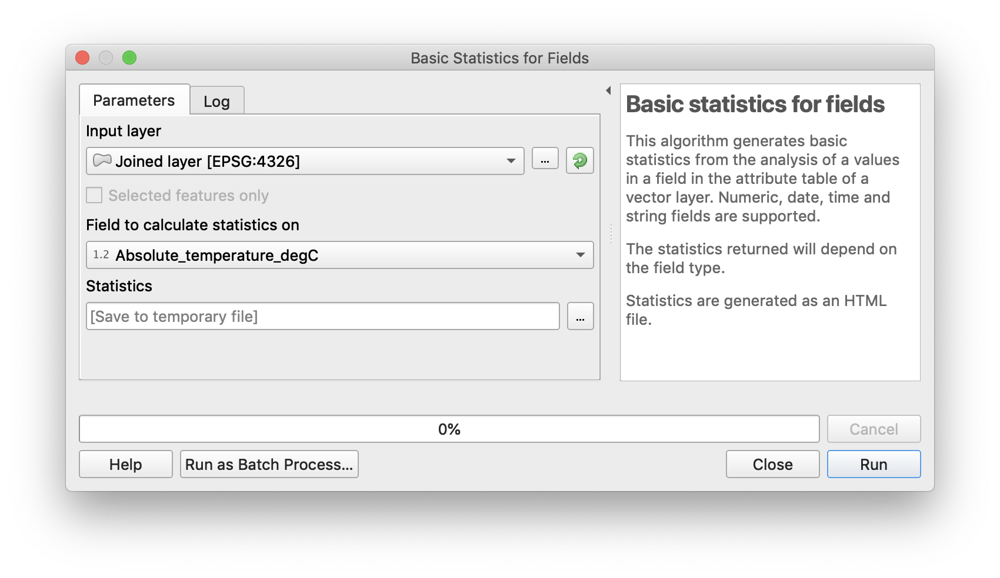

# Analyzing your Meteobike Data in QGIS

[QGIS](https://qgis.org) is a free and open-source Geographic Information System (GIS) that allows us to perform advanced geographical analysis of the data obtained from one or multiple Meteobike systems. It runs on Linux, Mac OSX, Windows and other systems. 

## Installing QGIS

Download [QGIS](https://qgis.org) and follow installation instructions, incluing the correct Python version.

## Importing and map Meteobike data in QGIS

In a first step we would like to import and map your Meteobike dataset.

### Set-up OSM as background map in QGIS

Open [QGIS](https://qgis.org) and create a new project using `Project` > `New` >. Save the new project under `Project` > `Save As...`. 

In the 'Browser' to the left, click on `XYZ Tiles` and double click `OpenStreetMap`. Open Street Map tiles will be shown.  At first, you will see the entire World. Use the cursor and zoom fuction to navigate to the city of your data.


### Importing Meteobike data to QGIS

You can import any .csv file into QGIS. This means, you can directly input the raw datafiles from the Meteobike system. Alternatively, you can also data that has been merged into a single file and filtered already. Use Menu `Layer` > `Add Layer` > `Add Delimited Text Layer...` to add data from one or multiple meteobike systems.


Choose the file of your interest (by clicking on the `...`-button in the upper right). 

Under 'File Format' select `CSV (comma separated values)`, under 'Record and Field Options' select `First record has field names` and `Detect field types`. Under 'Geometry Definition' it should automatically select 'Longitude' as `x field` and 'Latitude' as `y field`. 'Sample Data' displays your measurement dataset. Check if everything looks OK and then click `Add`.

Your measurements will be displayed as single points. Right click on the new layer and select `Properties...`. You can display the measured values as numeric labels. Under 'Labels' you can for example select the 'Temperature' field to show temperatures measured at that point:


Each point is now geo-referenced on Open Street Map and displays the measured temperatures:


For the course we recommend that you directly import the compiled file (`ALL-SYSTEMS-2019-06-26.csv`) which contains all systems corrected for cooling against the fixed weather station.

## Create statistics of temperatures in a specific area.

Assume you would like to calculate average temperatures measured in a park and contrast those to temperatures measured in a built-up area. You need to select points based on geographic location, for some areas with irregular shapes. One option to do this is to rund a 'spatial join' - a basic geographic operation. But first you have to define the geographic areas for which you would like to create statistics. In our example we will select temperatures in a park. You can do this with any other dataset, including imported shape files or 'Local Climate Zones' (LCZ).

### Create a polygon of the area

You must create a new layer to start drawing (or importing) polygons. First select Menu `Layer` > `Create Layer` > `New Shapefile Layer...`. Under 'File name' select an appropriate name (here, we will call it `parks.shp`) and use the `...`-button to store the shape file locally. As 'Geometry type' choose `Polygon`.

You can add properties to each polygon such as a name (or LCZ code etc.). As an example, we will create a field `Name` to provide the name of each park to the polygons. Name the filed and click `Add to Fields List`. Click `OK` to create the shape file.

Under `Layers` you will now see a new layer called "Parks". right-click on the 'parks' layer and select `Toggle Editing`. Then click the polygon-drawing icon () to draw a first park area:


Close the polygon by right-clicking. A dialog will appear to enter ID and Name (and other fields you have created). Enter and click `OK`:


You can finish here, or add additional polygons you would like to add to the conditional statistics the same way. Important: In the end, click again on `Toggle Edit` and save the shape file layer.

### Select subset of points within polygon

In a next step you would like to select all measurements inside the selected polygon. Choose menu `Vector` > `Data Management Tools` > `Join Attributes by Location`:


As 'Input Layer' choose your polygon (or multiple polygons) (e.g. 'parks.shp'). As join layer choose your points with temperatures from the meteobike dataset. Under 'Geometric predictate' you should choose `contains` and under 'Join type' you select `Create separate feature for each located feature (one-to-many)`. Then click on `run`. This will select all points that fall within the polygon. A new layer `Joined layer` will be created. You can rename the layer.

Right-click on the new `Joined layer` and select `Open Attribute Table`. You will get a list of all points in the polygons (and complemented with the polygon ID and name):


### Calculate statistics for subset

Select menu `Vector` > `Basic Statistics for Fields`. Choose your field of interest in the 'field to calculate statistics' menu:



You can open the output file to get all statistics for the points inside the polygon(s):

```
Analyzed field: Absolute_temperature_degC
Count: 21
Unique values: 14
NULL (missing) values: 0
Minimum value: 28.29
Maximum value: 29.86
Range: 1.5700000000000003
Sum: 610.2899999999998
Mean value: 29.061428571428564
Median value: 29.13
Standard deviation: 0.4053250983767842
Coefficient of Variation: 0.013947184233581527
Minority (rarest occurring value): 28.4
Majority (most frequently occurring value): 29.23
First quartile: 28.92
Third quartile: 29.23
Interquartile Range (IQR): 0.3099999999999987
```
