# Analyzing your Meteobike Data in QGIS

[QGIS](https://qgis.org) is a free and open-source Geographic Information System (GIS) that allows us to perform advanced geographical analysis of the data obtained from one or multiple Meteobike systems. It runs on Linux, Mac OSX, Windows and other systems. 

## Installing QGIS

Download [QGIS](https://qgis.org/en/site/forusers/download.html) and follow installation instructions. You can choose between the current version and the long-term release (most stable).

## Importing and map Meteobike data in QGIS

In a first step, we would like to import and map your Meteobike dataset.

### Set-up OSM as background map in QGIS

Open [QGIS](https://qgis.org) and create a new project using `Project` > `New` >. Save the new project under `Project` > `Save As...`. 

In the 'Browser' to the left, click on `XYZ Tiles` and double click `OpenStreetMap`. Open Street Map tiles will be shown.  At first, you will see the entire Earth. Use the cursor and zoom fuction to navigate to the city of your data.

### Importing Meteobike data to QGIS

You can import any .csv file into QGIS. This means, you can directly input the raw datafiles from the Meteobike system. Alternatively, you can also data that has been filtered and merged into a single file from multiple systems. Use Menu `Layer` > `Add Layer` > `Add Delimited Text Layer...` to add data from one or multiple meteobike systems.

Select the file of your interest (by clicking on the `...`-button in the upper right). 

Under 'File Format' select `CSV (comma separated values)`, under 'Record and Field Options' select `First record has field names` and `Detect field types`. Under 'Geometry Definition' it should automatically select 'Longitude' as `x field` and 'Latitude' as `y field`. 'Sample Data' displays your measurement dataset. Make sure that 'EPSG:4326 - WGS 84' is selected as your `Geometry CRS`.
Check if everything looks OK and then click `Add`.

Your measurements will be displayed as single points. Right click on the new layer and select `Properties...` to customize the display.

You can display the measured values as numeric labels next to the points. To do this, select 'Labels', activate `Single labels` and choose for example the 'Temperature' field to show numeric values of temperatures measured at that point:

Each point is displayed along with the measured temperature:

You can further color-code the points based on measured temperatures. Right click again on the new layer and select `Properties...`. Here you can select `Symbology` and choose `Graduated` as the model:

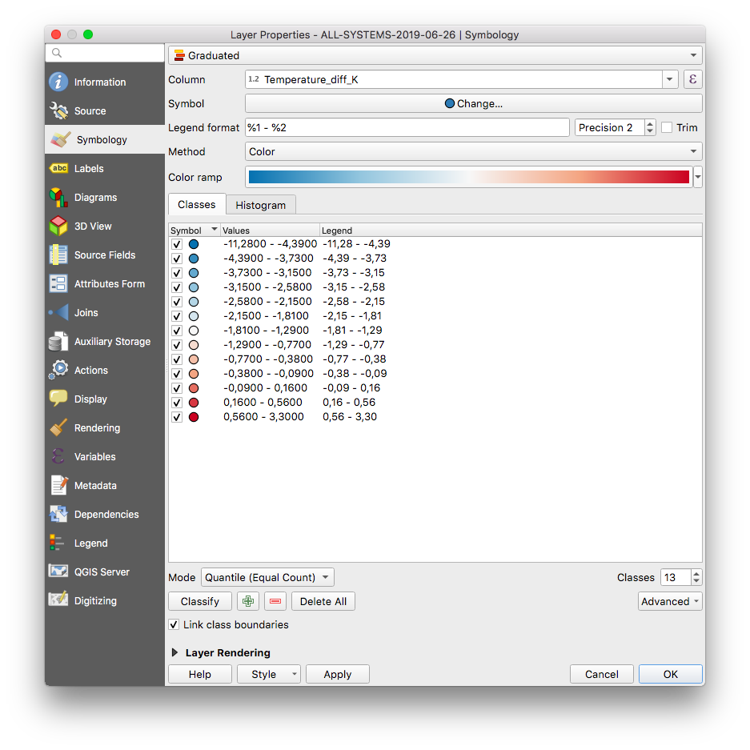

Under 'Column' select the field from the Meteobike dataset you would like to colorize (e.g. temperature differences). Unter 'Method' choose `Color`. Under 'Color ramp' you can choose from a variety of color bars (and also invert them, as done in the example). Below is the list that assigns colors to values. The example uses Quantile mapping with 13 classes. Click `Classify` to update the color ramp, then `OK` to apply it to the map:

## Create statistics of temperatures in a specific area.

Next assume, you would like to calculate average temperatures measured in different parks and contrast them. To do this, you need to select points based on geographic location - in some areas in complex, irregular shapes. One option to achieve this is through a 'spatial join' - a basic geographic operation selecting elements that are within another one. 

First you have to define the geographic areas in which you would like to sample measurements. In our example we will select temperatures in different parks, however, this approach can be applied to any other geographic dataset - including imported shape files, 'Local Climate Zones' (LCZ) or raster datasets on land cover classes (see below for examples).

### Create polygons of the areas of interest

Before you draw the areas, you must create a new layer. Select Menu `Layer` > `Create Layer` > `New Shapefile Layer...`. Under 'File name' select an appropriate name (here, we will call it `parks.shp`) and use the `...`-button to store the shape file locally. As 'Geometry type' choose `Polygon`.

You can later add properties to each polygon such as a name of the park (or LCZ, size of the park etc.). As an example, we will now simply create a field `Name` to enter the known local name of each park. Enter "Name" and and click `Add to Fields List`. Then click `OK` to create the shape file.

Under `Layers` you will now see a new layer called "Parks". Right-click on the 'Parks'-layer and select `Toggle Editing`. Then click the polygon-drawing icon () to draw a first park area:

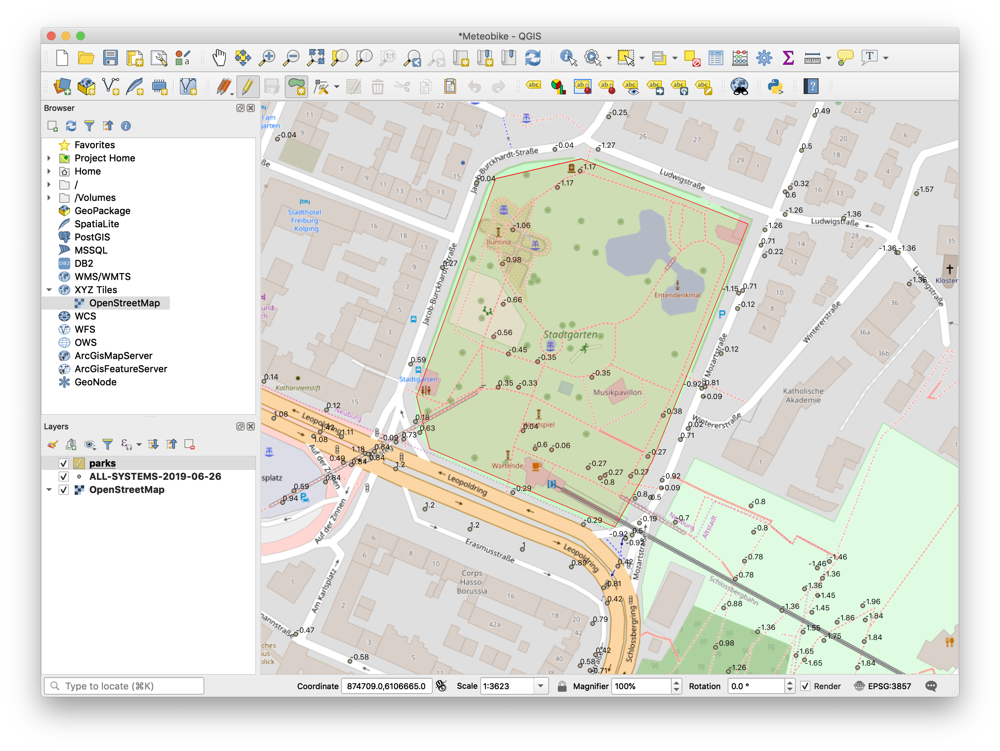

Close the polygon by right-clicking. A dialog will appear to enter ID and Name (and any other properties you have previously defined). Enter and click `OK`:

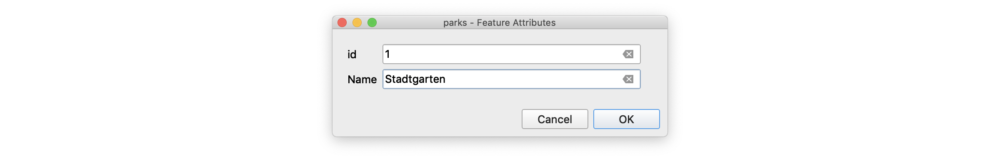

You can finish here, or add additional polygons for additional parks. In the end, after drawing one or multiple polygons, click again on `Toggle Edit` and save the shape file layer.

### Calculate statistics from points within polygon

In a next step you would like to select all measurements inside the selected polygon and calculate statistics based on only those points taht fall within the area. This is a more complex task, so you need the "Toolbox" for this. Select menu `Processing` > `Toolbox`. The toolbox appears on the right hand side of the map:

In the toolbox choose select `Vector general` > `Join attributes by location (summary)`:

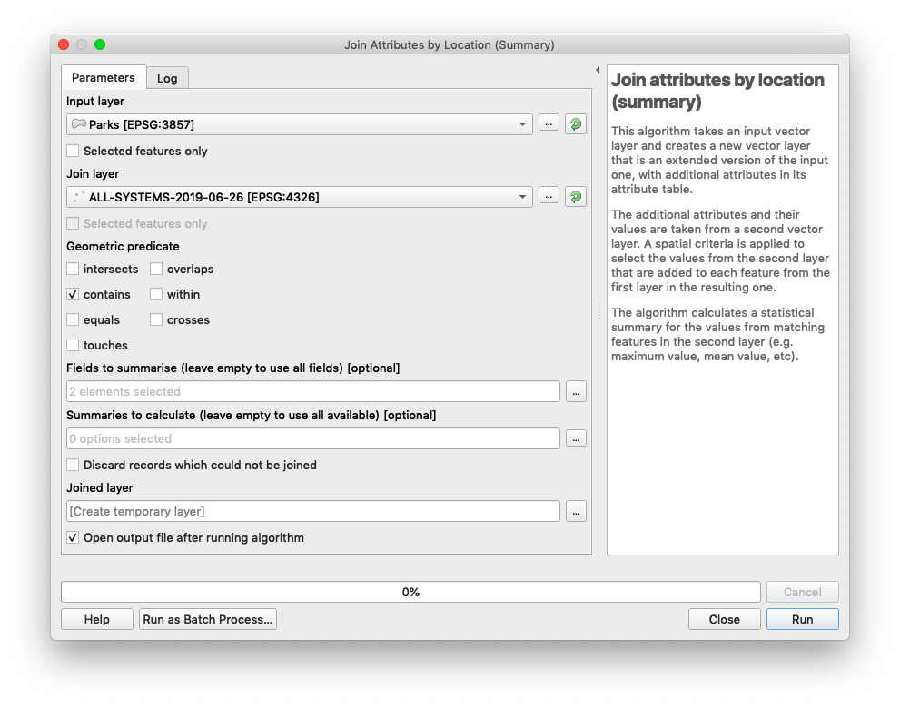

As 'Input Layer' choose your polygon-layer (i.e. 'parks.shp'). As join layer choose your points with temperatures from the meteobike dataset. Under 'Geometric predictate' you should choose `contains` and under 'Fields to summarize' you select the field from the meteobike dataset to create statistics from (i.e. Temperature). Then click on `run`. This will first select all points that fall within the polygon and then calculate statistics from those points and write them to the polygon as attributes. A new layer `Joined layer` will be created. You can rename the layer.

Right-click on the new `Joined layer` and select `Open Attribute Table`. You will now see a list of all parks with the statistics of the points (i.e. temperatures) displayed:

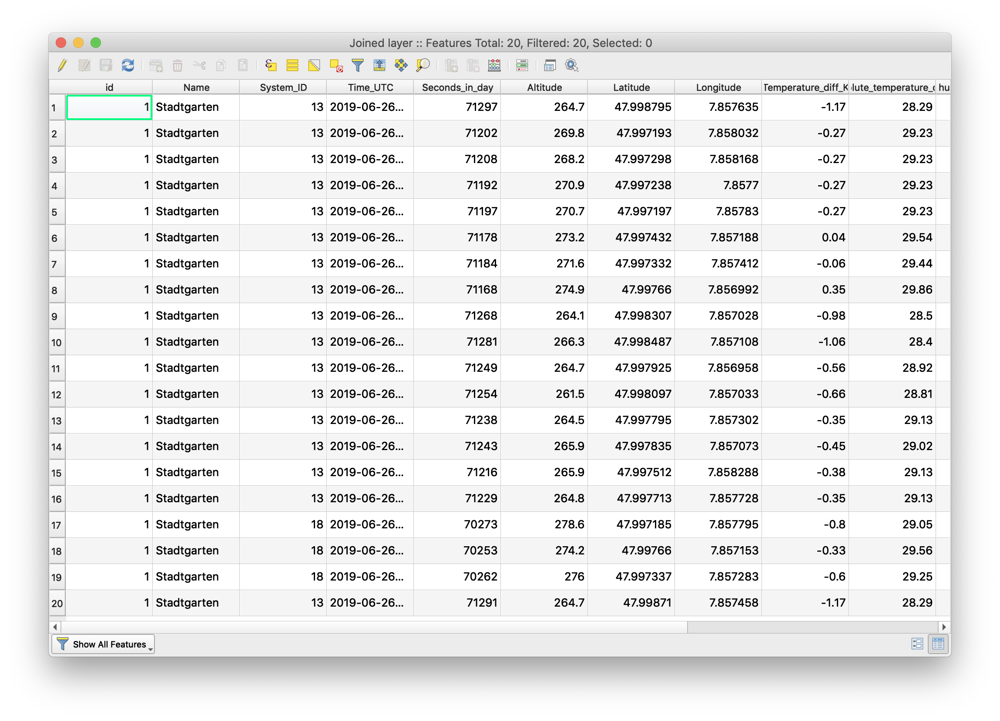

### Create a gridded map of the heat island

Essentially the same procedure can also be used to aggregate the measured datapoints in a gridded map. QGIS has an option to create different grids as polygon layers. To create a grid, select menu `Vector` > `Research Tools` > `Create grid...`:

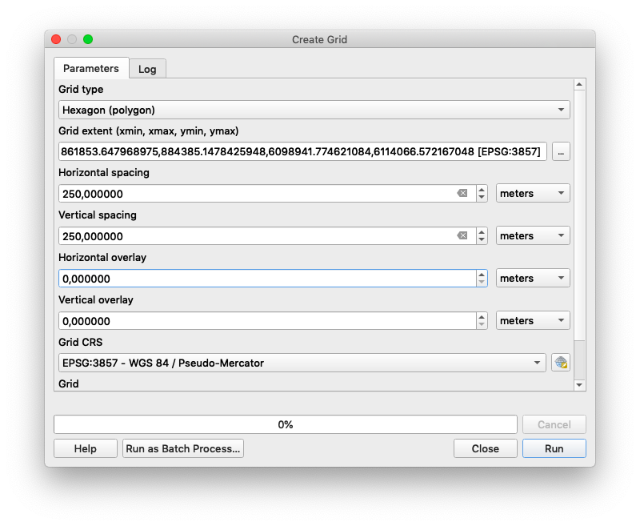

Because it is trendy, you can choose as grid type `Hexagon (polygon)`. To define the area that should be gridded, you can `Select canvas extent` by clicking on the icon with the cursor and the map right to the 'Grid extent' field (newer QGIS versions). Choose an appropriate grid size, e.g. 250 m and click `Run`. A new grid layer will be generated.

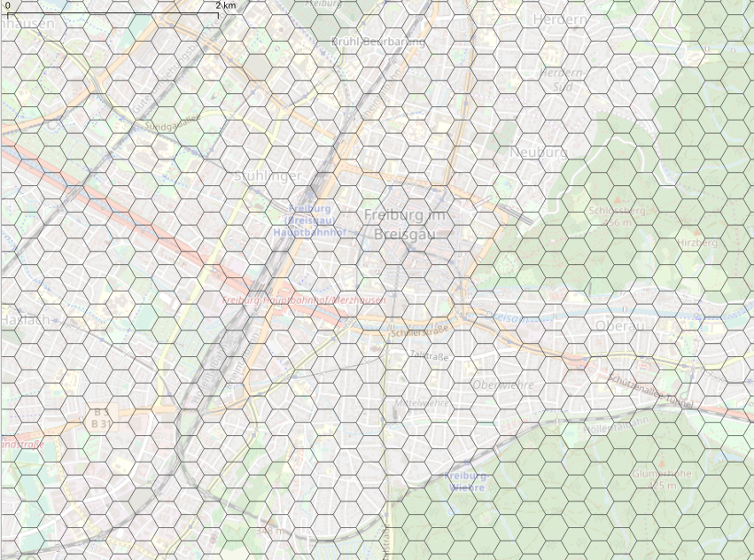

In the next step you can repeat what has been described above for the parks, but replace the parks with the grid polygons - Go to the `Toolbox` and select again `Vector general` > `Join attributes by location (summary)`. As 'Input Layer' choose the newly created grid layer )(the hexagons). As join layer choose again your points with temperatures from the meteobike dataset. It is recommended to select a limited number fields for startstics (only the ones you need) otherwise the operation will take a long time to be computed.

A new grid layer will be generated which is showing only cells where measurements are located within. You can right-click the new layer and choose `Properties...` attribute a color coding to the grid cells under `Symbology`. Choose `Graduated` as the model.

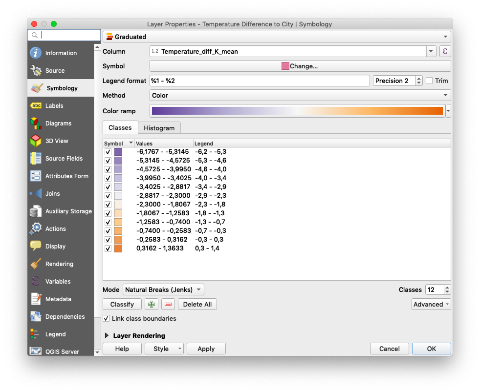

This way you finally get fancy heat map:

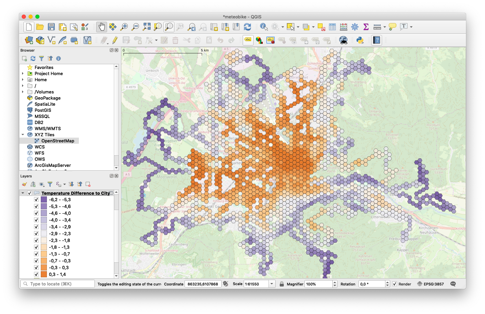

## Combining the Meteobike data with raster data

Some data sources such as Digital Elevation Models (DEM) or vegetation indices are provided in raster format, rather than vector format. In some application we would like to attribute values from rasters to our Meteobike measurements, or perform more detailed releif analysis.

### Importing a DEM and displaying the countour lines

As an example, we can import a DEM and combine it with the measurements from our Meteobikes. There are several free, globla DEMs available including

- [Copernicus Data EU DEM 1.1](https://land.copernicus.eu/imagery-in-situ/eu-dem/eu-dem-v1.1)
- [ASTER Global Digital Elevation Model](https://asterweb.jpl.nasa.gov/gdem.asp)
- [Space Shuttle Radar Topography Mission (SRTM)](https://earthexplorer.usgs.gov)

for elevation data you can also use the USGS [Global Data Explorer](https://earthexplorer.usgs.gov). Use the navigation tools on the website to zoom to the area of your interest. With the rectangular selection tool you can select an area to be downloaded:

If you create a free user account, you can download the ASTER Global DEM V2 in GeoTIFF format:

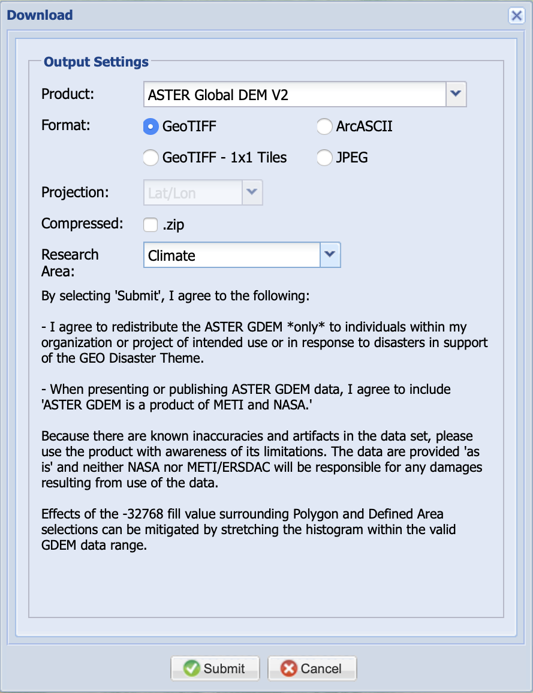

Save the '.tif' file locally on your machine. Then import the ASTER DEM into QGIS using the menu `Layer` > `Add Layer` > `Àdd Raster Layer`. Choose the previous '.tif' file with the ASTER Global DEM V2 as source:

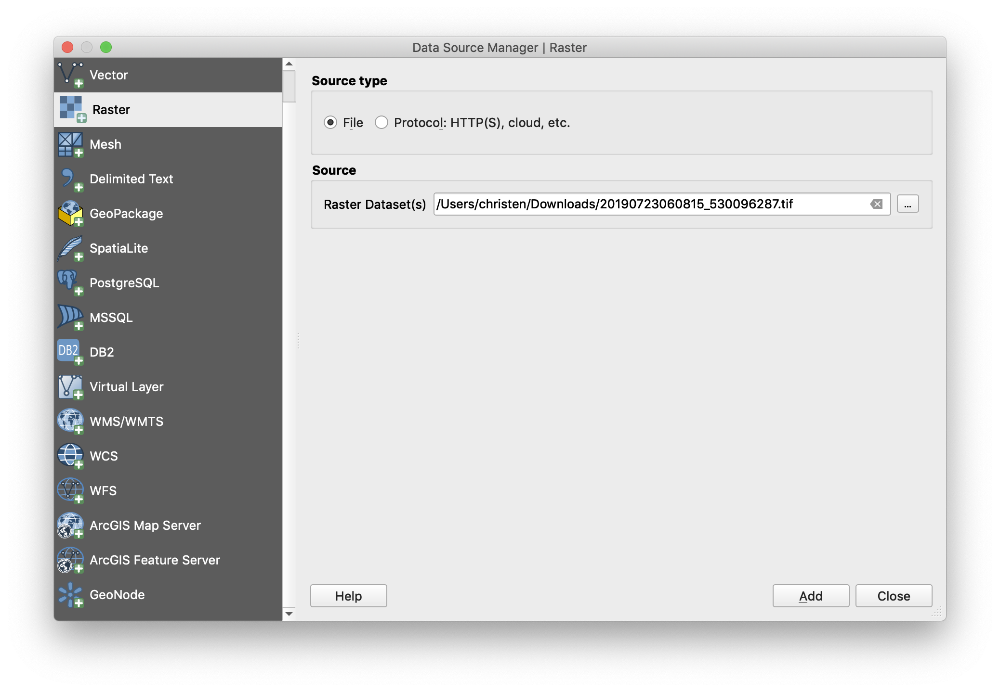

Right-click to change the appearance of the DEM to have different elevations displayed differently. To add countour lines go to the menu `Raster` > `Extraction` > `Contour...`.

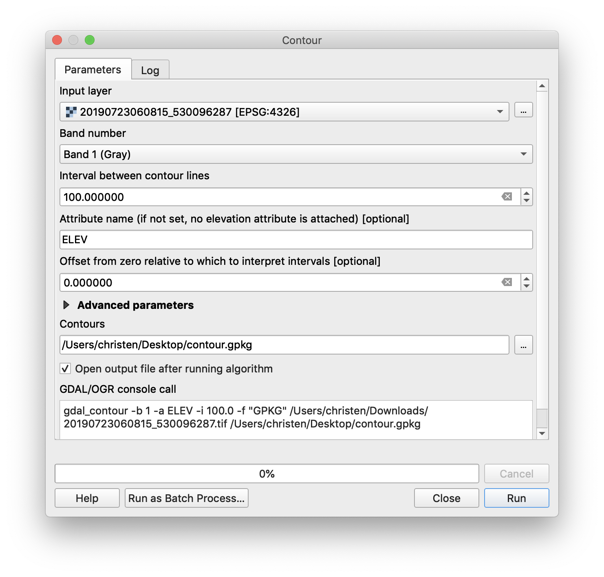

You can now display your Meteobike data along the digital elevation model:

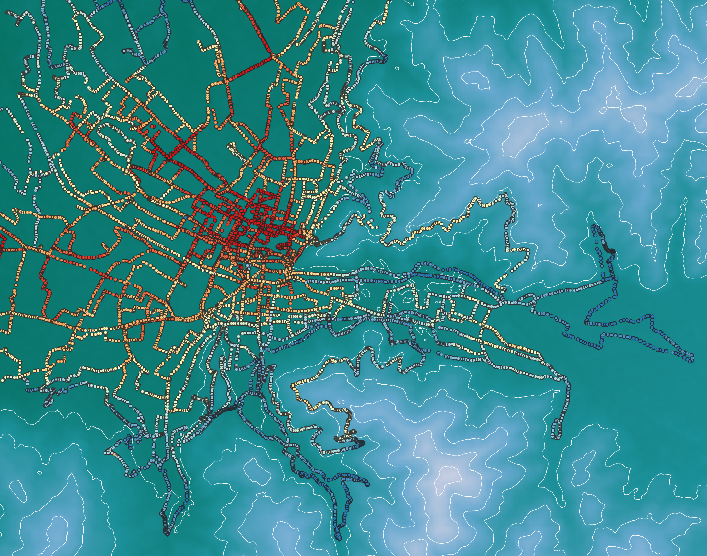

### Merge data from the DEM with the Meteobike data

To attribute data from a raster dataset to the point-measurements, go to the menu `Processing` > `Toolbox`. As an example, we will now attribute the elevation from the DEM to each measurement location of the Meteobike. In the Toolbox choose `SAGA` > `Vector <-> raster` > `Add raster values to points`. SAGA (System for Automated Geoscientific Analyses) is a free, hybrid, cross-platform GIS software that is included in QGIS as a plug-in. It contains many more specific scientific tools to analyze data.

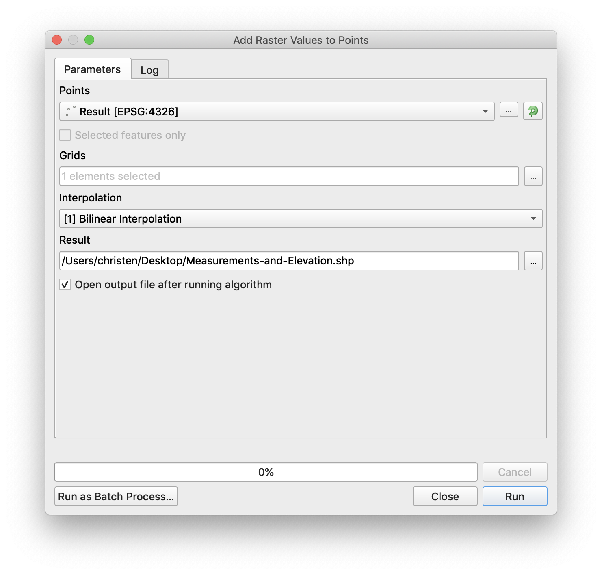

Choose the Meteobike Dataset as the 'Points' and the DEM as the 'Grid'. As points do not fall directly in teh center of pixels, you may ant to interpolate the data between pixels (e.g. here 'Interpolation' `[1] Bilinear interpolation`). Click `Run` to create a new point layer that has the original Meteobike data combined with the data from the DEM (elevation). You find the elevation from the DEM in the very last column of the 'Attribute Table'. You can now display the data with the elevation from the DEM. 

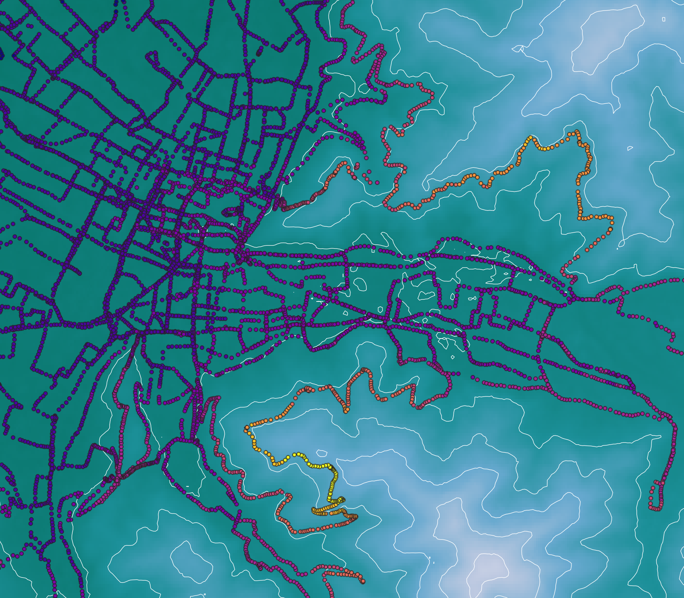

Note that the meteobikes already measured elevation (GPS Altitude) that should actually match the elevation data from the DEM - so there is currently no added value of doing this. Nevetheless, you can apply this procedure to any raster dataset (slope, catchment area, land cover data). There is a whole range of useful terrain analysis tools available in QGIS / SAGA for further analysis.

## Combining your meteobike data with other geodata

As a last exercise you may not only combine elevation information with temperatures, but also combine information on urban density, green cover with the meteobike temperature measurements. There are hundreds of different datasets available in cities.

For example we may be interested whether the amount of greenspace in an urban neighborhood has an influence on nocturnal air temperatures. Or is the density of buildings explaining the differences of nocturnal air temperatures?

In many cities, vector or raster data on the urban form, urban land use and three-dimensional structure is available. For Freiburg for example check out the [Catalogue of FreiGIS](https://geodaten.freiburg.de/geonetwork/srv/eng/catalog.search#/search?facet.q=type%2Fdataset)). Data can also be extracted from aerial photos, surveys (digital city models such as [CityGML](https://en.wikipedia.org/wiki/CityGML)) or even 3D laser scanning from aircrafts ([LIDAR](https://en.wikipedia.org/wiki/Lidar)). Here is an example of land cover information for Freiburg, Germany at 1 x 1 m resolution:

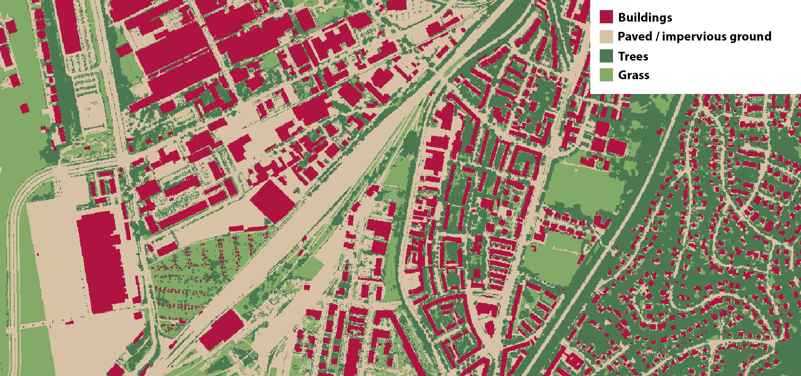

### Displaying land cover fractions

The dataset shown above is very detailed, every building, tree, driveway etc. is reflected. However, as air temperatures do not only depend on the  specific 1 x 1 m2 pixel they are measured over, but due to turbulent mixing, they are the response of a larger neighbood-scale energy balance, we cannot use this information directly. Instead we need data that is less detailed, yet retaines the statistics of the typical mix of buidlings, vegetation or impervious ground.

One common approach to describe the urban form and structure is to classify larger areas at the local-scale (50 m - 0,5 km) and derive *land cover fractions*. Land cover fractions describe the plan area covered by a particular land cover (e.g buildings) per total area. If a grid cell has a land cover fraction of 1 then the entire grid cell is equal to the corresponding land cover. 

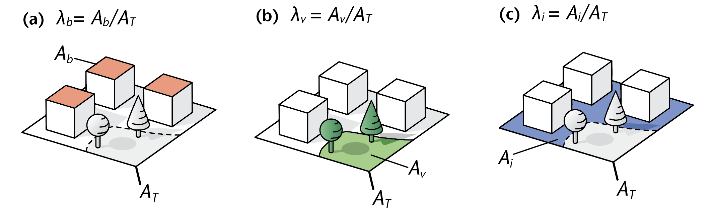

Conceptual illustration of land cover fractions of buildings (λb), vegetation (λv), and paved / impervious ground (λi). In all cases AT is the total area of the grid cell. Ab, Av and Ai is the projected area of buildings, vegetation and paved / impervious ground in the grid cell (Modified after: [Oke et al., 2017](https://www.cambridge.org/oke/), with permission from authors).

The following detailed land cover fractions for example are available for Freiburg at 50 x 50 m and 500 x 500 m resolution. Students at Uni Freiburg can download the relevant raster datasets from their Ilias course account.

Variable name | Description | Value range 
---- | ---- | ----
`lc_bldn` | Plan area fraction of buildings | 0 ... 1 
`lc_pavd` | Plan area fraction of paved / impervious ground | 0 ... 1 
`lc_tree` | Plan area fraction of tree crowns | 0 ... 1 
`lc_grss` | Plan area fraction of grass | 0 ... 1 
`lc_soil` | Plan area fraction of bare soil | 0 ... 1 
`lc_watr` | Plan area fraction of water bodies (lakes, rivers, ponds, pools) | 0 ... 1 

You can load land cover rasters at 50 x 50 m or 500 x 500 m as [ESRI Shapefiles](https://en.wikipedia.org/wiki/Shapefile) into QGIS. Choose `Layer` > `Add layer` > `Add vector layer...`. Then choose the downloaded land cover shape file (`.shp`) for the resolution you prefer. Make sure you have also downloaded the corresponding projection description (`.prj`) file, the attribute file (`.dbf`) and the shape index format file (`.shx`) in the same directory:

You can display the raster of land cover fractions by right-clicking on the added layer and choose `Properties....`. Choose a `Graduated`, select Mode: `Equal interval` and select a meaningful number of classes (at least 10) and the desired color ramp. 

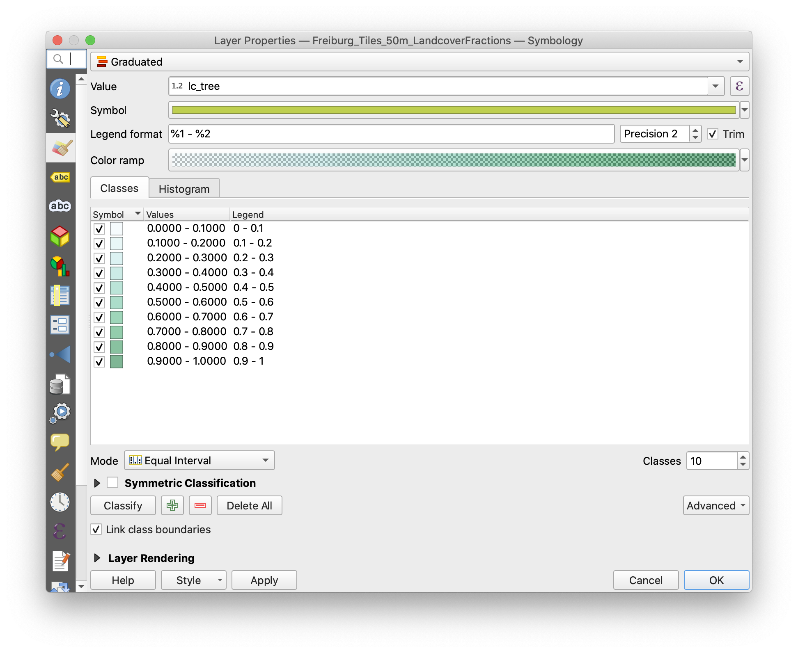

Click `Apply`.

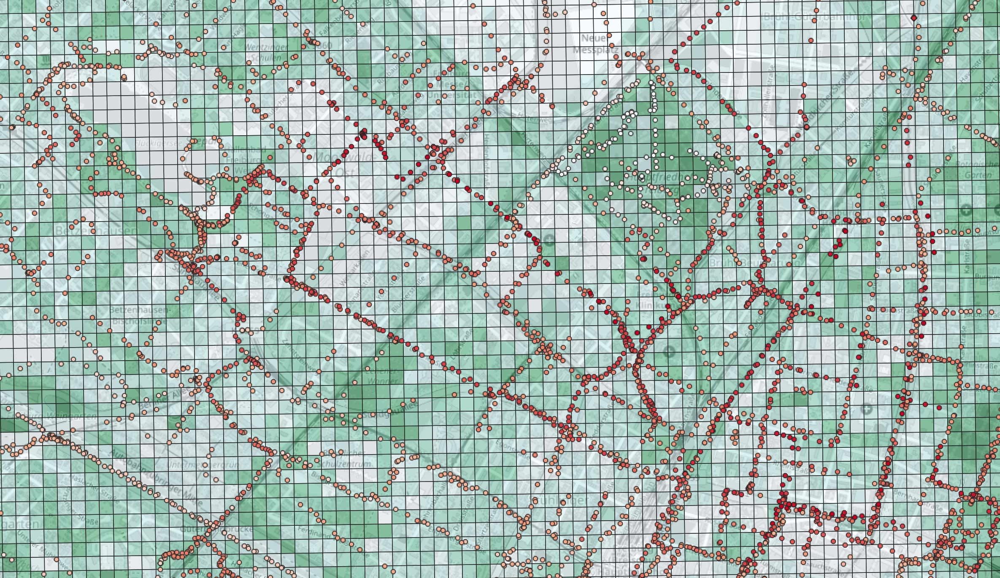

The figure shows an example of a subset of visualized `lc_tree` at 50 x 50 m resolution for Freiburg. Dark green grid cells contain a lot of trees (parks, forests), white grid cells have none to few trees. Dots are Meteobike measurements. Note that in this example the colors of the color ramp have been set to a transparancy of 50%. Further the map in the background has been set to a stauration of `-100` (right-click on the `OpenStreetMap` layer, select `Properties....`, then under `Symbology` in the section `Color Rendering` set `Saturation` to the mininunm). 

### Merge land cover fractions with the Meteobike data

Similar to what we did with the DEM, we can now attribute to each measurement location of air temperature the corresponding land cover fractions at 50 x 50 km or 500 km x 500 km. This will help us to answer questions if a particular land cover fraction controls the magnitude of the nocturnal heat island within cites. For that we will again use a spatial join. For example to attribute all meteobike measurements in a given land cover grid cell, you choose the function `Join attributes by location` in QGIS.

As 'Input Layer' choose your Meteobike Measurements (i.e. 'ALL-SYSTEMS-2021-06-15'). As join layer choose the land cover fractions. Under 'Geometric predictate' you should choose `within`. 

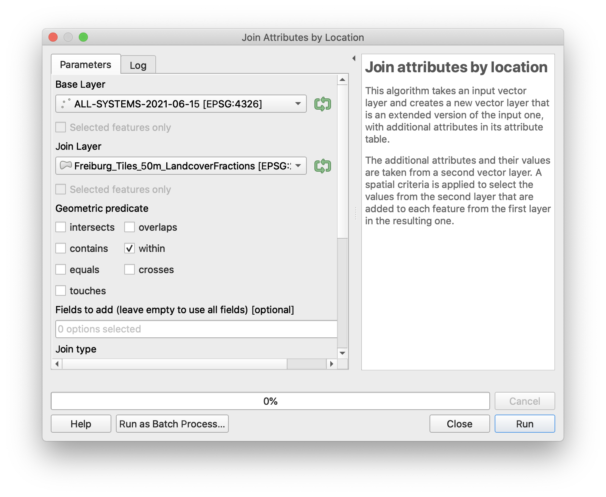

Click on `Run`. With 50 x 50 m raster this may take a while. This will for each measurement points attribute the corresponding land cover grid cell it falls into. A new layer `Joined layer` will be created. Again, you can rename the layer, e.g. 'ALL-SYSTEMS-2021-06-15-LC'.

The following graph shows the joined layer, once color-coded by temperature difference (field `Temperature_diff_K`) and once by tree cover fraction (field `lc_tree`):

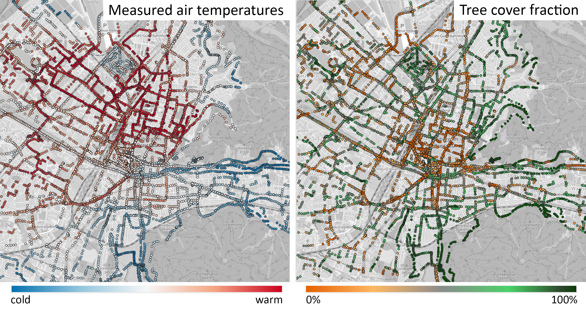

### Export Data back into R for further statistical analysis

For a further statitical analysis, it can be advantageous to export calculated statistics and joined attributes in QGIS into another high-level programming language such as `R`.

To export data from any layer you right-click the corresponding layer and select `Export` > `Save Frature as...`. For example the joined layer 'ALL-SYSTEMS-2021-06-15-LC' can be exported to statistically analyze whether there is a significant correlation between `lc_tree` and air temperatures.

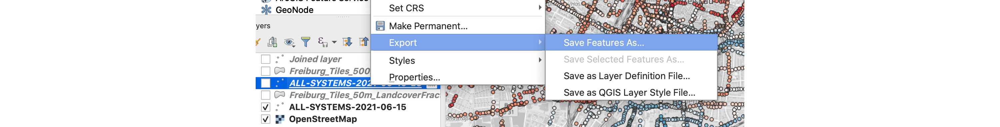

In the Dialog that appears, choose under `Format`: `Comma Separated Values`, choose a save location and  name under `File name` (clicking on the `...` button) and confirm by clicking `OK`. For example you can export the joined layer of air temperatures with land cover fractions (`TEXT`).

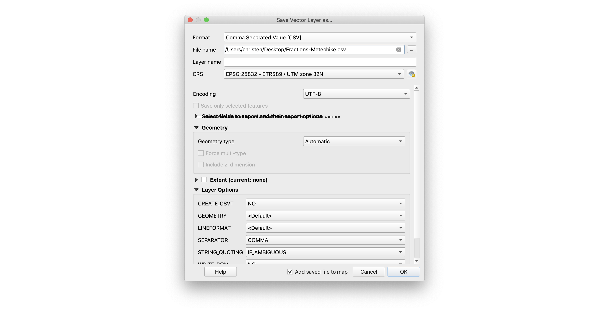

A comma separated value list is then saved that can be imported in the statistics software `R`.

For example in `R Studio` you can use the `read.csv` function to read the exported `.csv` file into a data frame:

      meteobike <- read.csv(file = '/Users/YourName/Desktop/Fractions-Meteobike.csv') 

The path must be adjusted to the save location of the above exported `.csv` file. The dataset in the `.csv` will be read into a data frame. You can now perform simple and fancy statistical analysis or graphing in `R` using the data in the `meteobike` data frame.
