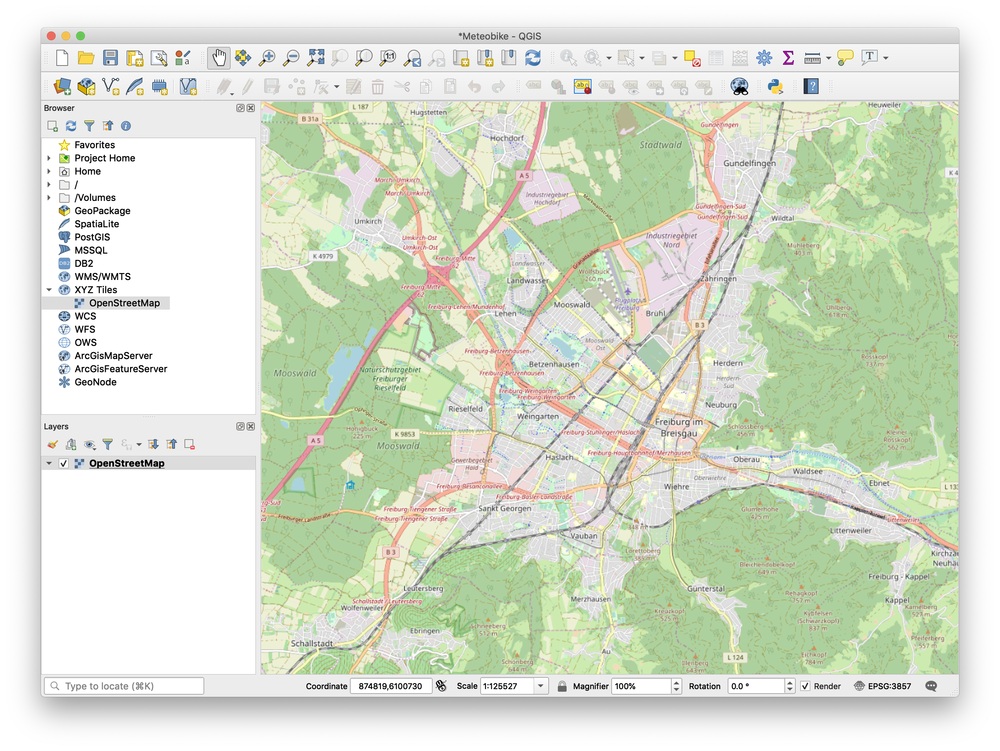
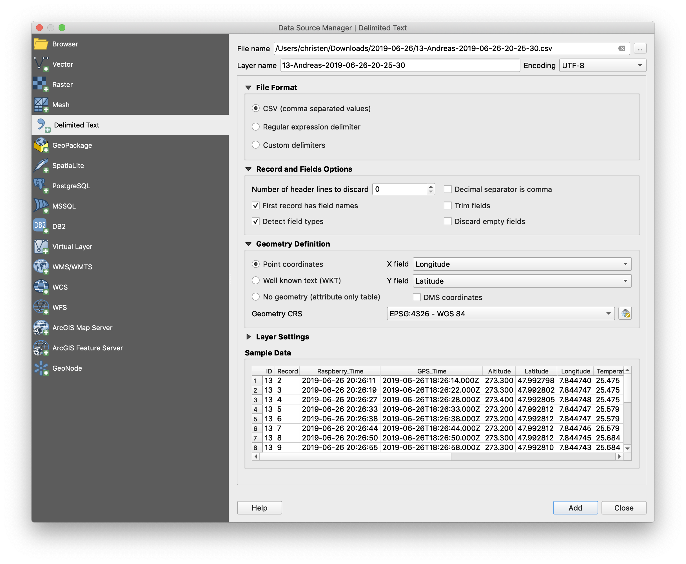
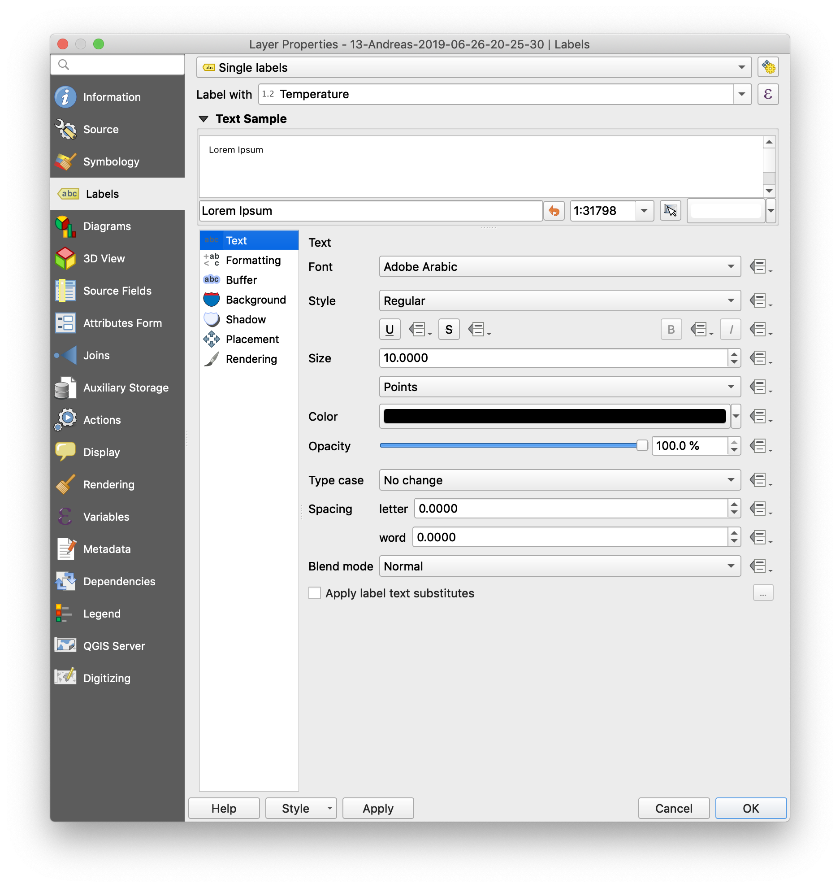
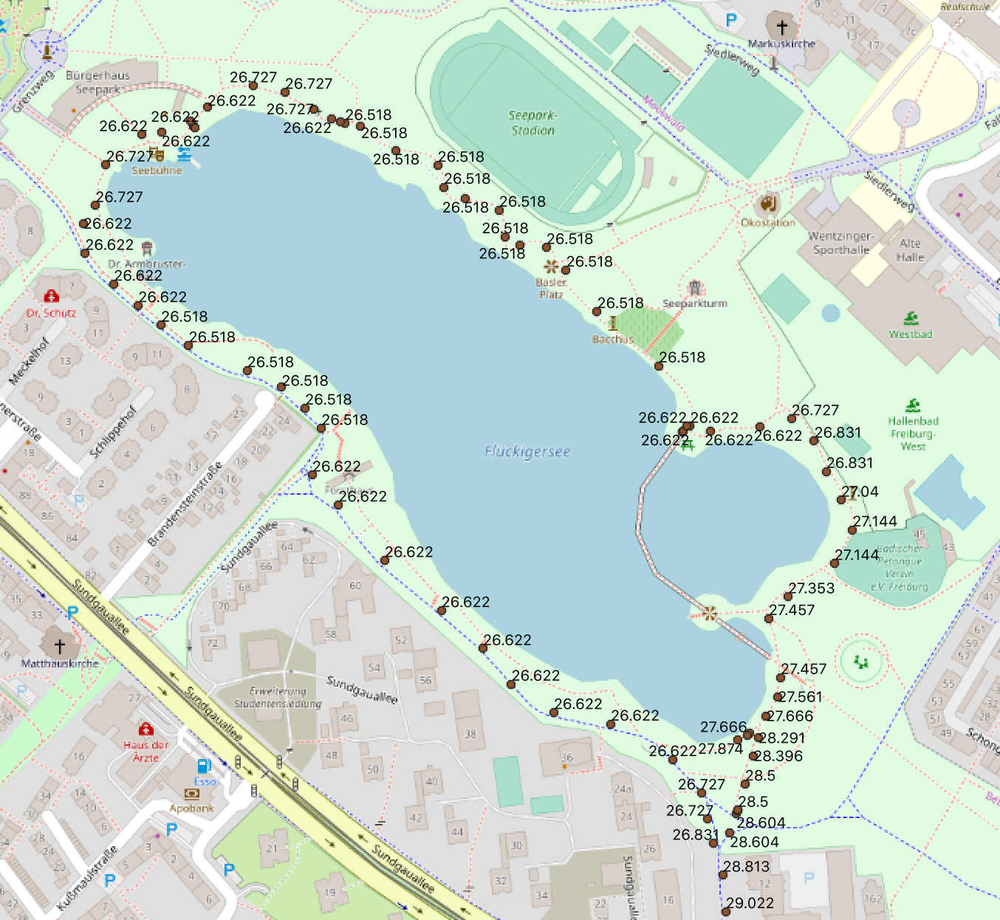
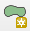

# Analyzing your Meteobike Data in QGIS

[QGIS](https://qgis.org) is a free and open-source Geographic Information System (GIS) that allows us to perform advanced geographical analysis of the data obtained from one or multiple Meteobike systems. It runs on Linux, Mac OSX, Windows and other systems. 

## Installing QGIS

Download [QGIS](https://qgis.org) and follow installation instructions, incluing the correct Python version.

## Importing and map Meteobike data in QGIS

In a first step we would like to import and map your meteobike dataset.

### Set-up OSM as background map in QGIS

Open [QGIS](https://qgis.org) and create a new project using `Project` > `New` >. Save the new project under `Project` > `Save As...`. 

In the 'Browser', click on `XYZ Tiles` and double click `OpenStreetMap`. Open Street Map tiles will be shown. Navigate to Freiburg.

### Importing Meteobike data to QGIS

You can import any .csv file into QGIS. Use Menu `Layer` > `Add Layer` > `Add Delimited Text Layer...`:

Choose the file of your system (by clicking on the `...`-button in the upper right). 

 Under 'File Format' select `CSV (comma separated values)`, under 'Record and Field Options' select `First record has field names` and `Detect field types`. Under 'Geometry Definition' it should automatically select 'Longitude' as `x field` and 'Latitude' as `y field`. 'Sample Data' displays your measurement dataset. Click `Add`.

Your trace will be displayed as single measurement points. Right click on the new layer and select `Properties...`. You can display the measured values as numeric labels. Under 'Labels' you can for example select the 'Temperature' field:

Each point is now geo-referenced and displays the measured temperatures:

Alternatively, you can directly import the compiled file (`ALL-SYSTEMS-2019-06-26.csv`) which has all systems corrected for cooling.

## Create statistics of temperatures in a specific area.

Assume you would like to contrast temperatures measured in a park to those measured in a buil-up area, you need to select points based on geographic location. One option to do this is a 'spatial join'. First you have to define the geographic areas for which you would like to create statistics. In our example we will select temperatures in a park. You can do this with any other dataset, including imported shape files.

### Create a poligon of the area

Create a new layer to draw polygons . First select Menu `Layer` > `Create Layer` > `New Shapefile Layer...`. Under 'File name' select an appropriate name (here, we will call it `parks.shp`) and use the `...`-button to store the shape file locally. As 'Geometry type' choose `Polygon`.

You can add properties such as a name to the shape file. For example you can create a field `Name` to provide a name to each polygon. Click `Add to Fields List`. Click `OK` to create the shape file.

Under `Layers` right-click on the 'parks' layer and select `Toggle Editing`. Then click the polygon-drawing icon () to draw the area of the park:

 Close the polygon by right-clicking. A dialog will appear to enter ID and Name (and other fields you have created). Enter and click `OK`:

