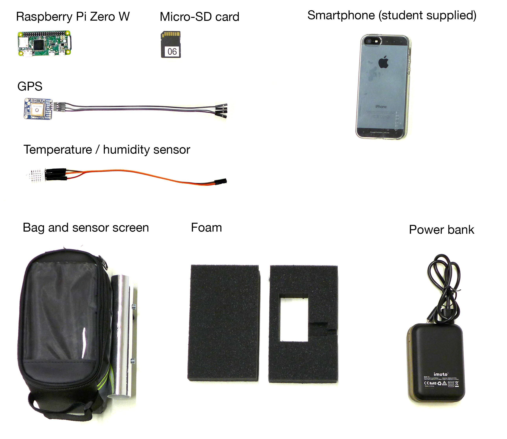
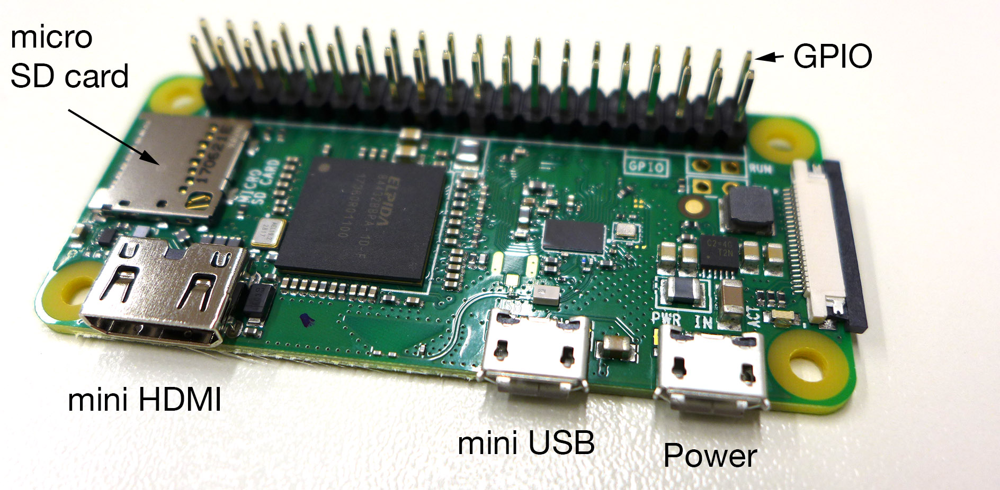
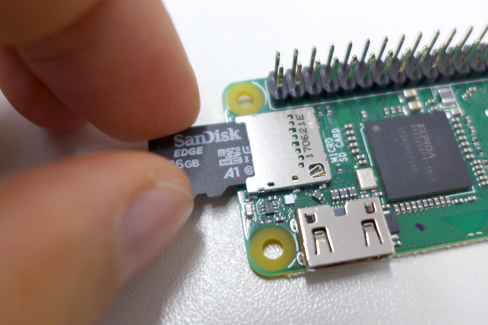
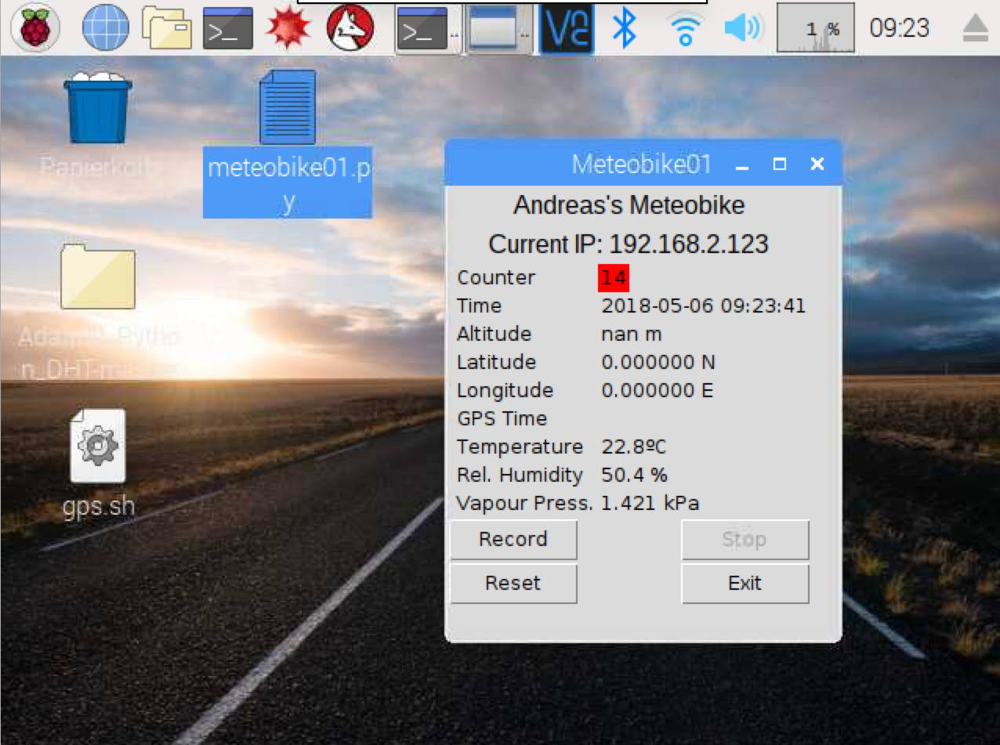

# Meteobike - Mapping urban heat islands with bikes

"Meteobike" is our educational Raspberry Pi Zero Project at the University of Freiburg, [Chair of Environmental Meteorology](http://www.meteo.uni-freiburg.de/). In our course "Tools in Meteoorology" as part of our Minor in "Meteorology and Climatology", we develop a system to measure, analyze and visualize urban heat islands. We measure temperature and humidity transcects and tag measurement locations with GPS. The system is battery operated and light, so it can be mounted on bikes. Communication with the Raspberry Pi Zero to your smartphone is enabled via wireless network.

## Overview

The mobile system is assembled using the following components:

## Preparing the Raspberry Pi Zero

### Connecting and starting the Raspberry Pi Zero

The Raspberry Pi Zero W is a microcomputer running a full operating system and providing input and output connectivity through a number of interfaces:

Your Raspberry Pi Zero W comes with a micro SD cards with the operating sysetm called [Raspbian](https://en.wikipedia.org/wiki/Raspbian) preinstalled. The micro SD is inside the larger SD card adapter. Pull it out and insert it carefully into the card slot.

The first time you set-up your Raspberry Pi Zero W you will need a few other components, which can be used for setting-up all systems one after another. This includes a screen, a keyboard and a mouse, and connection cables. 

Later, once the system is assigned to your wireless networks, you can connect to and operate it though RealVNC, so there is no need for a phsyical keyboard, a mouse or a screen during its operation. All can be controlled though your smartphone.

The connection cables and supplies you need are as follows (not shown is the screen):

To connect the screen during the initial set-up, connect the mini-HDMI cable to you screen (possibly using a HDMI to VGA adapter if your screen does not support HDMI and only VGA):

Next, connect the USB ports. Your Raspberry Pi Zero W hast two USB slots, one (left) is for the USB devices (mouse, keyboard), one (right) is for supplying power. First connect to the USB devices. Because there is only one Port, but you need to connect two devices, you must also add initially a USB HUB. Here is the set-up:

Finally connect the power supply to the right mini USB connector. The Raspberry Pi Zero W now starts up, the green inicator light begins to flash, and instructions follow on your screen.

### Setting-up the wireless network

Follow the instructions on-screen to set-up your Raspberry Pi Zero W. It will automatically reboot after resizing. 

Then connect to the wireless network. Click in the menu-bar on the wireless network icon, select our network and enter the password. Details on the password and network can be found on your desk. Hover with the mouse over the network icon to read the IP number. Note the IP number on your sheet on the desk.

Next, localize the Raspberry Pi Zero W to your language and region. Provide a password to the Raspberry. Set the same password as the wireless network, so we have all the same password. Make sure it starts with a capital letter. Also change the Hostname to "raspberryXX" where XX is the number of your system (see sheet on your table):

### Testing the wireless network

Test the communication with another device (your laptop or smartphone). First, on your laptop or smartphone install the "VNC Viewer" from "RealVNC":

* On Mac, Windows, or Linux install the [desktop version of the VNC Viewer](https://www.realvnc.com/de/connect/download/viewer/).
* On iOS devices use the [Apple App Store to download the VNC Viewer](https://itunes.apple.com/us/app/vnc-viewer/id352019548?mt=8
).
* On Android devices use  [Google Play to download the VNC Viewer](https://play.google.com/store/apps/details?id=com.realvnc.viewer.android).

Make sure your laptop or smartphone is connected to the same wireless as the Raspberry Pi Zero W. Then start your viewer, connect to the IP address you previously noted (likely `192.168.X.Y`) and enter the suername "pi" with the password we have previously set.

You should be able to control your Raspberry Pi Zero W, use the mouse and keybord remotely.

## Installing the Sensors

### Installing the DHT 22 Sensor

The DHT22 is a low-cost digital temperature and humidity sensor. It contains a capacitive humidity sensor and a thermistor (resistor that changes with temperature). It transfers data digitally to your Raspberry Pi Zero W. You need just three cables to connect the DHT22 to the Raspberry Pi Zero W - one for power (red), one for the signal (orange) and one for the ground (brown).

To enable communication with the DHT22 , enter the following commands into the command line on the Raspberry Pi Zero to install first the Adafruit DHT 22 library:

    $ sudo apt-get update
    $ sudo apt-get install build-essential python-dev python-openssl git
    $ git clone https://github.com/adafruit/Adafruit_Python_DHT.git
    $ cd Adafruit_Python_DHT
    $ sudo python setup.py install

Turn off the Raspberry Pi Zero. Disconnect the power cable from the Raspberry Pi Zero. Connect the DHT22 sensor physically using the pre-soldered wires, with the following color coding on the pins of the Raspberry Pi Zero:

| DHT22 T/RH Sensor | Cable Color | Raspberry Pi Zero |
| ------------------ | ----------- | ----------------- |
| PIN 1  | Red Cable  | PIN 1 (3V+)
| PIN 2 | Orange Cable  | PIN 7 (GPIO4)
| PIN 3 | (no cable)  |
| PIN 4 | Brown Cable  | PIN 9 (Ground)

Double check if the connection is correct. A wrong connection could damage the Ssensor and or the Raspberry Pi Zero. Then reconnect the power cable to the Raspberry Pi Zero. The Raspberry Pi Zero restarts, and its green light flashes.

Once started, the DHT 22 Sensor can be polled with the following commands in Python. First start the Phython environment for Python 2.7 in interactive mode. In Python, enter

    >>> import Adafruit_DHT
    >>> humidity, temperature = Adafruit_DHT.read_retry(Adafruit_DHT.DHT22,4)
    >>> print temperature, humidity
  
This will display the currently measured values. The system measured temperature and humidity every two seconds.

Next, as an exercise you can calculate the vapour pressure using the Clausius-Clapeyron equation. First calculate the saturation vapour pressure in kPa, then convert the relative humidity to vapour pressure. Note that temperature needs to be converted to Kelvins first.

    >>> import numpy 
    >>> saturation_vappress = 0.6113 * numpy.exp((2501000.0/461.5)*((1.0/273.15)-(1.0/(temperature+273.15))))
    >>> vappress=(humidity/100.0)*saturation_vappress
    >>> print vappress
    
Can you also calculate the dewpoint temperature?    

## Installing the GPS Module

The Adafruit Ultimate GPS is a 66 channel Global Positioning System using satellites to accurately determine your location, speed and altitude. It digitally communicates with the Raspberry Pi Zero W over four cables:

To enable communication with the Raspberry Pi Zero W, start the Raspberry's console and type:

    $ sudo apt-get install gpsd gpsd-clients python-gps
    $ sudo systemctl stop serial-getty@ttyS0.service 
    $ sudo systemctl disable serial-getty@ttyS0.service

For the Raspberry Pi Zero we need to enable the serial port on the GPIO pins. Open the "nano" text editor and change the file `config.txt`
    
    $ sudo nano /boot/config.txt
    
Scroll to the the very bottom of the file with the arrow keys an add this on a new line:
    
    enable_uart=1
    
Save and Exit with Ctrl-0 (German: Strg-O) and Ctrl-X (Strg-X) and then reboot the Raspberry Pi Zero.

Once rebotted, run these commands to use the serial port:
    
    $ sudo killall gpsd 
    $ sudo gpsd /dev/ttyS0 -F /var/run/gpsd.sock
    
Next, edit the file /etc/rc.local using the nano editor:

    $ sudo nano /etc/rc.local 

An insert at the very end, but above the line `exit 0` the following command:

    gpsd /dev/ttyS0 -F /var/run/gpsd.sock
    
Now, every time the Raspberry Pi Zero is booted, this command will be executed. 

Turn off the Raspberry Pi Zero. Disconnect the power cable from the Raspberry Pi Zero. Connect the GPS physically using the pre-soldered wires, with the following color coding on the pins of the Raspberry Pi Zero:

| GPS  | Cable Color | Raspberry Pi Zero |
| ------------------ | ----------- | ----------------- |
| PVIN | Black Cable  | PIN 4 (5V+)
| GND  | White Cable  | PIN 6 (Ground)
| RX   | Grey Cable  | PIN 8 (TXD)
| TX.  | Purple Cable  | PIN 10 (RXD)
    

Double check if the connection is correct. Then reconnect the USB cable, the HDMI cables, and finally the power cable to the Raspberry Pi Zero. The Raspberry Pi Zero restarts, and the green light flashes.  

You can then test the GPS using:

    $ cgps -s

# Running the Recording Interface

We want the data from the GPS and the DHT22 to be automatically collected and written into a file. We would also benefit from having the system data displayed in real time on screen. This is done with the python program `meteobike.py`, which you can download on your Raspberry Pi Zero here:

* [Download meteobike.py](meteobike.py)

You can start `meteobike.py` using the Terminal (assuming your file has been downloaded to the desktop)
   
    $ python /home/pi/Desktop/meteobike.py 
    

    
Next, make changes to personalize your copy of `meteobike.py`. 

* Replace "01" on line 41 `raspberryid =` to your system#s two digit number. If your system has the number "7" enter "07".
* Replace "andreas" on line 42 `studentname =` to your first name in quotes.

Every time `meteobike.py` is started, it will create a new log-file that contains the data sampled. Here is an example:

ID | Record | Raspberry_Time  | GPS_Time  | Altitude  | Latitude  | Longitude  | Temperature  | RelHumidity  | VapourPressure
--- | --- | --- | --- | --- | --- | --- | --- | --- |  --- | 
01 | 8 | 2018-05-06 08:29:03 | 2018-05-06T06:29:04.000Z  | 281.700 | 47.991855 | 23.0 | 41.9 | 1.196
01 | 9 | 2018-05-06 08:29:11 | 2018-05-06T06:29:12.000Z  | 288.000 | 47.991375 | 22.9 | 41.9 | 1.188
01 | 10 | 2018-05-06 08:29:24 | 2018-05-06T06:29:25.000Z  | 290.000 | 47.991242 | 23.0 | 41.9 | 1.196

You can also place a link - called bash file on your desktor (`meteobike.sh`)

* [Download meteobike.sh](meteobike.sh)

Change permissions of the file as follows, so it is executable, i.e. it can be started with a double-click:

    $ chmod +x  /home/pi/Desktop/meteobike.sh
    
Then you can double-click `meteobike.sh` to start the user interface and start recording.
    
