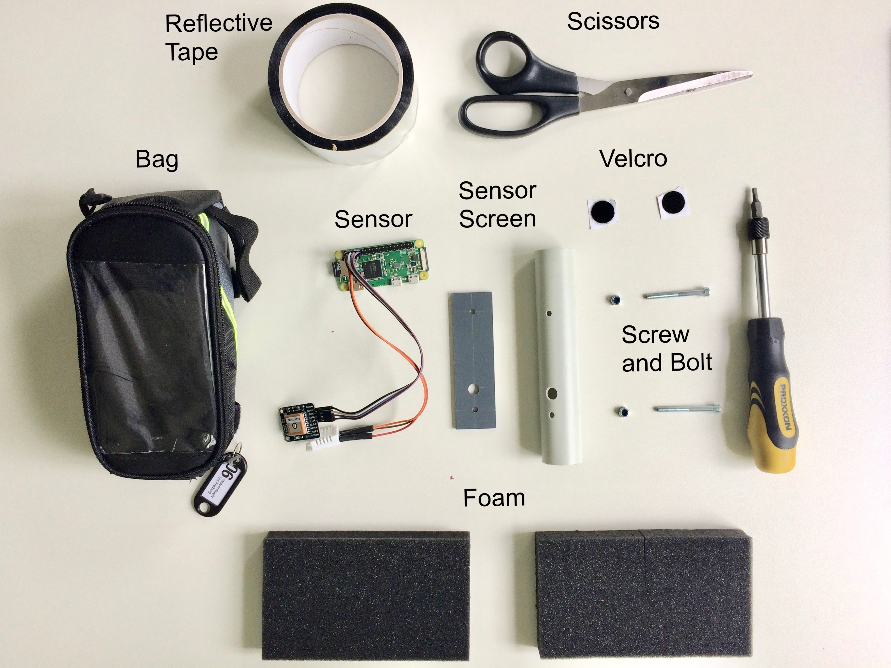
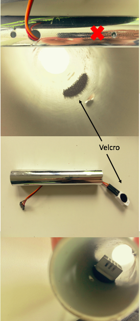
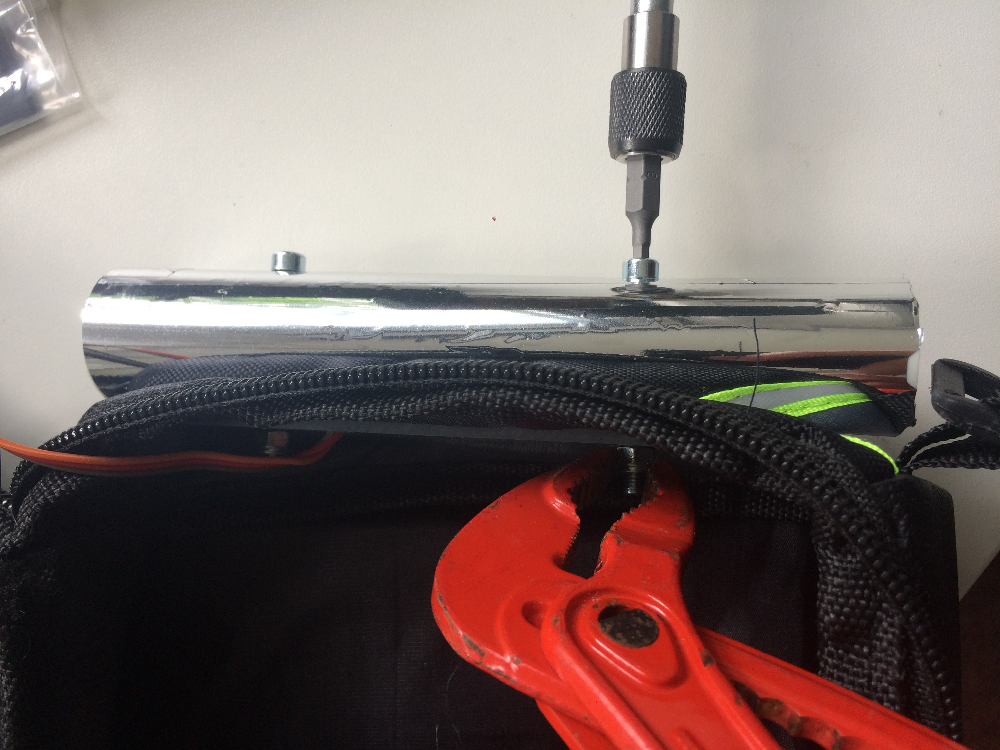
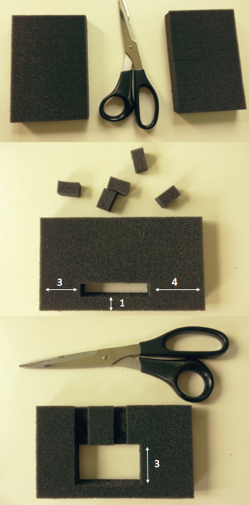
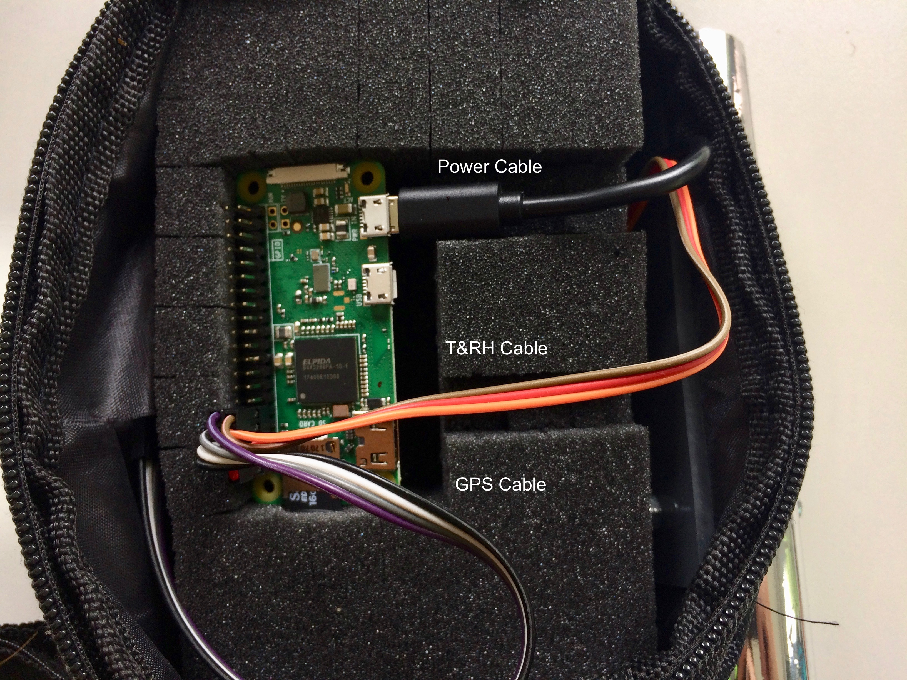

# Meteobike - Mapping urban heat islands with bikes

"Meteobike" is our educational Raspberry Pi Zero Project at the University of Freiburg, [Chair of Environmental Meteorology](http://www.meteo.uni-freiburg.de/). In our course "Tools in Meteorology" (5th Term of our Minor in "Meteorology and Climatology"), we develop a system to measure, analyze and visualize the urban heat island effect. Within a short period (~2 hours), we measure with many systems simultaneously temperature and humidity transcects inside and outside the city and tag measurement locations with GPS. The system is battery operated and light, so it can be mounted on bikes. Communication with the Raspberry Pi Zero to our smartphone is enabled via wireless network.

## Overview

Each student builds a own mobile system. Each system will be assembled using the following components:

## Preparing the Raspberry Pi Zero

### Connecting and starting the Raspberry Pi Zero

The [Raspberry Pi Zero W](https://shop.pimoroni.de/collections/raspberry-pi/products/raspberry-pi-zero-w?src=raspberrypi) is a microcomputer running a full operating system and providing input and output connectivity through a number of interfaces:

Your Raspberry Pi Zero W comes with a micro SD cards with the operating sysetm (called [Raspbian](https://en.wikipedia.org/wiki/Raspbian)) preinstalled. The micro SD card is inside the larger regular SD card "adapter". Pull the micro-SD card out and insert it carefully into the card slot. Make sure the logo is up and the hand-painted white number on the back.

The first time you set-up your Raspberry Pi Zero W, you will need a few additional components. Those components can be used for setting-up multiple systems in a row. The components you need are 

* Screen (HDMI or VGA)
* USB keyboard 
* USB mouse
* A USB hub
* Various interface cables. 

In our course, you share a screen, a keyboard and a mouse, and connection cables between two students each.

Later, once the system is assigned to your wireless networks, you can connect to it without keybord, without mouse and without Screen using RealVNC, so there is no need for a phsyical keyboard, a mouse or a screen during the bike traverses. All can be controlled on your smartphone or tablet, or just be operated remotely.

Here are all connection cables and supplies you need for the initial set-up (screen is not shown):

To connect the screen during the initial set-up, connect the mini-HDMI cable to you screen (possibly using a HDMI to VGA adapter if your screen does not support HDMI and only VGA):

Next, connect the USB ports. Your Raspberry Pi Zero W has two mini-USB ports, one (left) is for the USB devices (mouse, keyboard), one (right) is actually only for supplying power. First connect to the USB devices (left). Because there is only one true USB port, but you need to connect two devices, you must also add initially a USB hub. Here is the set-up:

Finally connect the power supply to the right mini USB connector. The Raspberry Pi Zero W now starts up, the green inicator light begins to flash, and instructions follow on your screen.

### Setting-up the wireless network

Follow the instructions on-screen to set-up your Raspberry Pi Zero W. It will automatically reboot after resizing. 

Then connect to the wireless network. Click in the menu-bar on the wireless network icon, select our network and enter the password. Details on the password and network can be found on your desk. Hover with the mouse over the network icon to read the IP number. Note the IP number on your sheet on the desk.

Next, localize the Raspberry Pi Zero W to your language and region. Provide a password to the Raspberry. Set the same password as the wireless network, so we have all the same password. Make sure it starts with a capital letter. Also change the Hostname to "raspberryXX" where XX is the number of your system (see sheet on your table):

### Testing the wireless network

Test the communication with another device (your laptop or smartphone). First activate VNC. Go to settings, and enable "VNC". You can also enable SSH und I2C.

Next, on your laptop or smartphone install the "VNC Viewer" from "RealVNC":

* On Mac, Windows, or Linux install the [desktop version of the VNC Viewer](https://www.realvnc.com/de/connect/download/viewer/).
* On iOS devices use the [Apple App Store to download the VNC Viewer](https://itunes.apple.com/us/app/vnc-viewer/id352019548?mt=8
).
* On Android devices use  [Google Play to download the VNC Viewer](https://play.google.com/store/apps/details?id=com.realvnc.viewer.android).

Make sure your laptop or smartphone is connected to the same wireless as the Raspberry Pi Zero W. Then start your viewer, connect to the IP address you previously noted (likely `192.168.X.Y`) and enter the username "pi" with the password we have previously set.

You should be able to control your Raspberry Pi Zero W and you can use a mouse and keybord remotely.

## Installing the Sensors

### Installing the DHT 22 Sensor

The [DHT22](https://learn.adafruit.com/dht/overview) is a low-cost digital temperature and humidity sensor. It contains a capacitive humidity sensor and a thermistor (resistor that changes with temperature). It transfers data digitally to your Raspberry Pi Zero W. You need just three cables to connect the DHT22 to the Raspberry Pi Zero W - one for power (red), one for the signal (orange) and one for the ground (brown).

To enable communication with the DHT22 , enter the following commands once into the `LXTerminal` (the command line) on the Raspberry Pi Zero to install  the Adafruit DHT 22 library. Once the library is installed, you can access it from the programming language Python.

    $ sudo apt-get update
    $ sudo apt-get install build-essential python-dev python-openssl git
    $ git clone https://github.com/adafruit/Adafruit_Python_DHT.git
    $ cd Adafruit_Python_DHT
    $ sudo python setup.py install

Next, turn off the Raspberry Pi Zero. Disconnect the power cable from the Raspberry Pi Zero. Connect the DHT22 sensor physically using the pre-soldered wires, with the following color coding on the pins of the Raspberry Pi Zero:

| DHT22 T/RH Sensor | Cable Color | Raspberry Pi Zero |
| ------------------ | ----------- | ----------------- |
| PIN 1  | Red Cable  | PIN 1 (3V+)
| PIN 2 | Orange Cable  | PIN 7 (GPIO4)
| PIN 3 | (no cable)  |
| PIN 4 | Brown Cable  | PIN 9 (Ground)

Double check if the connection is correct. A wrong connection could damage the sensor and or the Raspberry Pi Zero. Then reconnect the power cable to the Raspberry Pi Zero. The Raspberry Pi Zero restarts, and its green light flashes.

Once started, the DHT 22 Sensor can be polled with the following commands in Python. First start the Phython development environment for Python 2.7 in interactive mode. In Python, enter

    >>> import Adafruit_DHT
    >>> humidity, temperature = Adafruit_DHT.read_retry(Adafruit_DHT.DHT22,4)
    >>> print temperature, humidity
  
This will display the currently measured values. The system measures temperature and humidity every two seconds.

Next, as an exercise you can calculate the vapour pressure using the Clausius-Clapeyron equation. First calculate the saturation vapour pressure in kPa, then convert the relative humidity to vapour pressure. Note that temperature needs to be converted to Kelvins first.

    >>> import numpy 
    >>> saturation_vappress = 0.6113 * numpy.exp((2501000.0/461.5)*((1.0/273.15)-(1.0/(temperature+273.15))))
    >>> vappress=(humidity/100.0)*saturation_vappress
    >>> print vappress
    
Can you also calculate the dewpoint temperature?    

## Installing the GPS Module

The Adafruit Ultimate GPS is a 66 channel Global Positioning System using satellites to accurately determine your location, speed and altitude. It digitally communicates with the Raspberry Pi Zero W over four cables:

To enable communication with the Raspberry Pi Zero W, start the Raspberry's `LXTerminal` and type:

    $ sudo apt-get install gpsd gpsd-clients python-gps
    $ sudo systemctl stop serial-getty@ttyS0.service 
    $ sudo systemctl disable serial-getty@ttyS0.service
    $ sudo systemctl stop gpsd.socket
	$ sudo systemctl disable gpsd.socket
    
For the Raspberry Pi Zero we need to enable the serial port on the GPIO pins. This requires us to change the configuration file of the Raspberry Pi Zero W. You can use a texteditor, for example the `nano` command in `LXTerminal` and edit the file `config.txt`
    
    $ sudo nano /boot/config.txt
    
Scroll to the the very bottom of the file (not with a mouse, but with the arrow keys) and then type this on a new line:
    
    enable_uart=1
    
Save with `Ctrl`+`0` (German: `Strg`+`O`), and then press `Enter`. Next press `Ctrl`+`X` (`Strg`+`X`) to exit the `nano` editor. Finally, reboot the Raspberry Pi Zero.

Once rebooted, disable the standard socket, and run this command in the `LXTerminal` to enable the serial port:
    
    $ sudo gpsd /dev/ttyS0 -F /var/run/gpsd.sock
    
Next, edit the file /etc/rc.local, again using the `nano` editor:

    $ sudo nano /etc/rc.local 

An insert at the very end, but above the line `exit 0` the following line:

    gpsd /dev/ttyS0 -F /var/run/gpsd.sock
    
Save with `Ctrl`+`0` (German: `Strg`+`O`), and then press `Enter`. Next press `Ctrl`+`X` (`Strg`+`X`) to exit the `nano` command line editor.     
    
Now, every time the Raspberry Pi Zero is booted, this command will be executed. 

Turn off the Raspberry Pi Zero. Disconnect the power cable from the Raspberry Pi Zero. Connect the GPS physically using the pre-soldered four wires, with the following color coding on the pins of the Raspberry Pi Zero:

| GPS  | Cable Color | Raspberry Pi Zero |
| ------------------ | ----------- | ----------------- |
| PVIN | Black Cable  | PIN 4 (5V+)
| GND  | White Cable  | PIN 6 (Ground)
| RX   | Grey Cable  | PIN 8 (TXD)
| TX.  | Purple Cable  | PIN 10 (RXD)
    

Double check if the connection is correct. Then reconnect the power cable to the Raspberry Pi Zero. The Raspberry Pi Zero restarts, and the green light flashes.  

Now, you can test the GPS using:

    $ cgps -s

Note: If the GPS is searching for a signal it will flash red 5 times in 10seconds and if it flashes red once in 15 seconds it has been connected to the satellites.

# Running the Recording Interface

We want the data from the GPS and the DHT22 to be automatically collected and written into a file. We would also benefit from having the system data displayed in real time on screen. This is done with the python program `meteobike.py`, which you can download on your Raspberry Pi Zero here:

* [Download meteobike.py](meteobike.py)

You can start `meteobike.py` using `LXTerminal` (assuming your file has been downloaded to the desktop)
   
    $ python ~/Desktop/meteobike.py 
    

    
Next, make changes to personalize your copy of `meteobike.py`. You can, for example, open the Python Development Environment (Version 2.7) and `File > Open`. 

* Replace "01" on line 41 `raspberryid =` to your system#s two digit number. If your system has the number "7" enter "07".
* Replace "andreas" on line 42 `studentname =` to your first name in quotes.

Then save the modified code `File > Save`. Close the Python Development Environment.

Every time `meteobike.py` is started, it will create a new data-file that contains the data sampled. Here is an example:

ID | Record | Raspberry_Time  | GPS_Time  | Altitude  | Latitude  | Longitude  | Temperature  | RelHumidity  | VapourPressure
--- | --- | --- | --- | --- | --- | --- | --- | --- |  --- | 
01 | 8 | 2018-05-06 08:29:03 | 2018-05-06T06:29:04.000Z  | 281.700 | 47.991855 | 7.845193 | 23.0 | 41.9 | 1.196
01 | 9 | 2018-05-06 08:29:11 | 2018-05-06T06:29:12.000Z  | 288.000 | 47.991375 |  7.845212 | 22.9 | 41.9 | 1.188
01 | 10 | 2018-05-06 08:29:24 | 2018-05-06T06:29:25.000Z  | 290.000 | 47.991242 |  7.845800 | 23.0 | 41.9 | 1.196

You can also place a link - called bash script on your desktop (`meteobike.sh`)

* [Download meteobike.sh](meteobike.sh)

To ensure it works, you must change permissions of the file as follows (make it executable). This way, it can be started with a double-click:

    $ chmod +x  ~/Desktop/meteobike.sh
    
Now you can double-click `meteobike.sh` to start the user interface.

## Assembly of the system

Materials needed to complete the assembly of system include: 

* Reflective Tape 
* Scissors 
* Sensor Screen/Radiation Shield
* Bag
* GPS/T&RH Sensor
* Velcro
* Screw & Bolt 
* Foam

To begin the assembly of the Meteobike system, carefully cut the reflective tape to the length of the white plastic tube. Wrap the tube with the tape lengthwise, cut another piece of the same length and repeat this step with minimal overlap of the first piece of tape. The two pieces of tape should cover the entire tube.

Now that the tube is completely covered with the tape, use the scissors to puncture a hole in the tape where the holes on the tube are located. This is the sensor screen for the temperature and humitidy sensor. 

To connect the temperature and humidity sensor to the radiation shield, you must disconnect the temperature and humidity sensor from the Raspberry Pi, please ensure the sensor is not connected to any source of power.

You will use the cirlce hook and loop velcro to attach the sheild and sensor. Place one piece on the inside of the radiaiton shield on the side that has 3 holes. It should be located close to the small hole that is farthest from the large hole. Place the second peice of velcro on the back side of the temperature and humidity sensor. 

Pass the wires from the sensor through the shield and through the largest hole, then press the sensor to the shield and ensure the velcro will hold the sensor and shield together. 

Place the shield close to the bag and put the temperature and humidity sensor wires through the large hole in the bag.

Now you must connect the radiation shield and the sensor to the bag. To do this, you will use a HX3 screwdriver to insert the bolt and screw through the sheilds two holes and through the hole that is on the bag. 

Using a wrench to hold the bolt in place, use the screwdriver to insert the screw into the bolt to hold it secure. Place the 
thin plastic plate with the same holes on the inside of the bag apply the screw through it and the bolt on the inside. 

You can now reconnect the  the DHT22 sensor physically using the pre-soldered wires to the Raspberry Pi W. 

| DHT22 T/RH Sensor | Cable Color | Raspberry Pi Zero |
| ------------------ | ----------- | ----------------- |
| PIN 1  | Red Cable  | PIN 1 (3V+)
| PIN 2 | Orange Cable  | PIN 7 (GPIO4)
| PIN 3 | (no cable)  |
| PIN 4 | Brown Cable  | PIN 9 (Ground)

Please double check to make sure the connection is correct. 

To ensure the protection of the sensor, a special foam is used. As you can see it is structured into cubical formation that allows you to take out the specific size you need. 

When sizing the foam for the Raspberry Pi, you will remove the foam cubes from the arrangement found below

There are two locations in the foam where you must use the scissors to remove only half of the cube. This is the location where the power cable and the temperature and humidity sensor cables can be guided. 

The foam piece that was not altered will be used as the base protection between the battery on the bottom of the bag and the Raspberry Pi that will be placed inside the altered foam. 

The GPS system can be placed into the opposite side of the sensor shield on the inside of the bag. 

When you have completed the assembly it should look similar to the image below. 

## Display the recorded GPS track

The GPS track is stored by the Raspberry on the desktop as a comma-separated file.

If the Raspberry is in the same WLAN as the host computer, then you can easily establish an FTP connection and copy this file to the host (on the Mac, for example with Cyberduck). 

A graphical representation of the track can be done place on the website http://www.gpsvisualizer.com/map_input

Simple drawing of a track
At top left choose "With: 1400", then at the top right under "Upload" choose your file  and Click on Draw the map.

Color-coded drawing by temperature
Under "Track options" click on "advanced options" and make the following settings below:

Colorize by: custom field
Custom colorization field: temperature
Spectrum direction: down
Hue 1: 120
Hue 2: 0

Then click on "Draw the map”.

There are also option to export it into Google Earth, you could explore and describe. 

Here is an example

