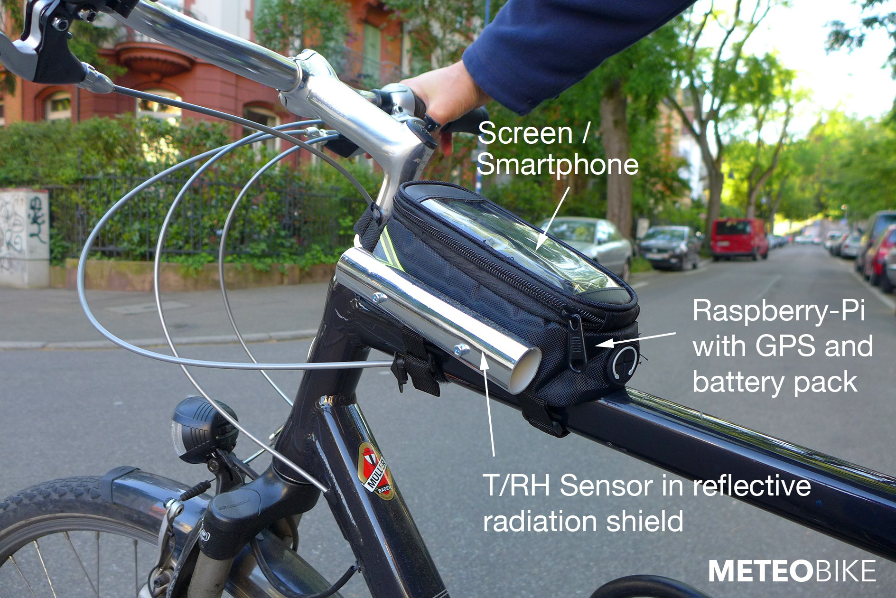
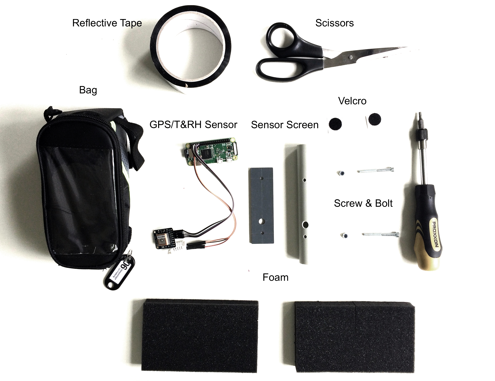
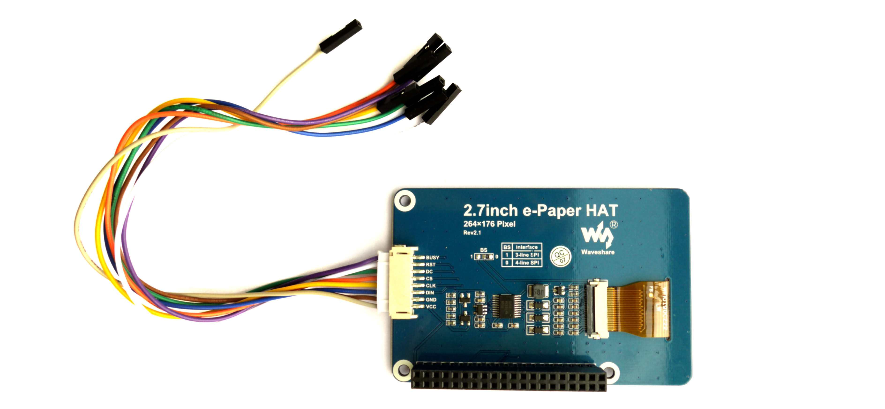

# Meteobike - Mapping urban heat islands with bikes

"Meteobike" is our educational Raspberry Pi Zero Project at the University of Freiburg, [Chair of Environmental Meteorology](http://www.meteo.uni-freiburg.de/). In our course "Tools in Meteorology" (5th Term of our [Minor in "Meteorology and Climatology"](http://www.meteo.uni-freiburg.de/de/lehre/b-sc-nebenfach)), we develop a system to measure, analyze and visualize the urban heat island effect. Within a short period (~2 hours), we measure with many systems simultaneously temperature and humidity transcects inside and outside the city and tag measurement locations with GPS. The system is battery operated and light, so it can be mounted on bikes. Communication with the Raspberry Pi Zero to our smartphone is enabled via wireless network.



## Overview

Students build their own mobile systems. Each system will be assembled using the following components:

| Component | Model | Link to Vendor in Germany | Price |
| ------------------ | ----------- | ----------- | ---------- | 
| Microcontroller | Raspberry Pi Zero W | [Pimoroni.de](https://shop.pimoroni.de/products/raspberry-pi-zero-w) | 10 EUR |
| GPS | Adafruit Ultimate GPS Breakout | [Pimoroni.de](https://shop.pimoroni.com/products/adafruit-ultimate-gps-breakout) | 40 EUR |
| Temperature / Humidity Sensor | DHT22 AM2302  | AZ-Delivery ([Amazon.de](https://www.amazon.de/dp/B06XF4TNT9/)) | 5 EUR |
| Micro SD Card | NOOBS 16GB microSD | [Pimoroni.de](https://shop.pimoroni.de/products/noobs-microsd-card) | 5 EUR |
| Battery | POWERADD Pilot 2GS Powerbank 10000mAh* | Poweradd ([Amazon.de](https://www.amazon.de/gp/product/B00J93R7XM/)) | 15 EUR |
| Jumper Wires | Elegoo Jumper Wire* | GYE ([Amazon.de](https://www.amazon.de/dp/B01EV70C78/)) | 7 EUR |
| Screen | 2.7inch e-Paper HAT | [Reichelt.de](https://www.reichelt.de/developer-boards-2-7-e-ink-display-black-white-debo-epa-2-7-p224220.html?trstct=pos_7&nbc=1&&r=1) | 20 EUR | 

* Can be replaced by any other product


## Workshop 1 - Setting up the Raspberry Pi Zero and connecting the sensors 

In this first workshop you will connect the Raspberry Pi Zero to a mouse, a keyboard and a screen to set it up properly. Then we will connect the temperature/relative humidiy sensor and a GPS. If they are working, we will install a user-interface to collect automatically your data and store it on the SD card.

### Connecting and starting the Raspberry Pi Zero

The [Raspberry Pi Zero W](https://shop.pimoroni.de/collections/raspberry-pi/products/raspberry-pi-zero-w?src=raspberrypi) is a microcomputer running a full operating system and providing input and output connectivity through a number of interfaces:


#### Setting-up the SD-card

Your Raspberry Pi Zero W comes with a micro SD card that contains the operating sysetm (called [Raspbian](https://en.wikipedia.org/wiki/Raspbian)) preinstalled. In some cases, the micro SD card is housed inside the larger regular SD card "adapter". Pull the micro-SD card out and insert it carefully into the card slot. Make sure the logo is up and the hand-painted white number (or sticker) on the back.


#### Setting-up temporary peripherals (mouse, keyboard, screen)

The first time you set-up your Raspberry Pi Zero W, you will need a few additional components. The components you need are 

* Screen (with a HDMI, VGA or DVI connection)
* USB keyboard 
* USB mouse
* A USB hub and a micro-USB to USB-A convertor.
* A power supply

In our course, you are provided with a USB Hub, a micro-USB to USB-A. You provide the screen, a USB keyboard and a USB mouse, possibly also a regular HDMI cable.

Later, once the system is assigned to your wireless networks, you can connect to it without keybord, without mouse and without Screen using RealVNC, so there is no need for a phsyical keyboard, a mouse or a screen in later exercises or during the bike traverses. All can be remotely controlled from your laptop, your smartphone or tablet.

Here are all connection cables and supplies you need for the initial set-up (specific models may vary, screen is not shown):


First, connect the USB mouse and keyboard. Your Raspberry Pi Zero W has two mini-USB ports, one (left) is for the USB devices (mouse, keyboard), one (right) is actually only for supplying power (see below). First connect to the USB devices (left). Because there is only one true USB port, but you need to connect two devices, you must also add initially a USB hub. Here is the set-up:


To connect your screen to TV during the initial set-up, connect first a mini-HDMI to HDMI coverter. Then you can use a regular HDMI cable to connect it to you screen (In rare cases you need a mini-HDMI to VGA adapter if your screen does not support HDMI and only VGA, or a mini-HDMI to DVI adapter if your screen does not support HDMI and only DVI).


#### Power-up the system

Finally connect the power supply to the right mini USB connector. The Raspberry Pi Zero W now starts up, the green inicator light begins to flash, and instructions follow on your screen.

#### Setting-up the wireless network

In case this is a first-time installation, follow the instructions on-screen to set-up your Raspberry Pi Zero W. It will automatically reboot after resizing. In most cases this is not needed, as your OS is already fully installed and operational.

Then connect to your home wireless network. Click in the menu-bar on the wireless network icon, select your home network and enter your password. Hover with the mouse over the network icon to read the IP number. Note the IP number on a sheet as you will need it later.


Next, localize the Raspberry Pi Zero W to your language and region. Check if the hostname is "raspberryXX" where XX is the number of your system. This is needed to identify your system.


At this point we recommend to reboot your Raspberry Pi.

#### Remote connection via the wireless network

Test the communication with another device (your laptop or smartphone). First activate VNC. Go to settings, and enable "VNC". You can also enable SSH und I2C.


Next, on your laptop or smartphone install the "VNC Viewer" from "RealVNC":

* On Mac, Windows, or Linux install the [desktop version of the VNC Viewer](https://www.realvnc.com/de/connect/download/viewer/).
* On iOS devices use the [Apple App Store to download the VNC Viewer](https://itunes.apple.com/us/app/vnc-viewer/id352019548?mt=8
).
* On Android devices use  [Google Play to download the VNC Viewer](https://play.google.com/store/apps/details?id=com.realvnc.viewer.android).

Make sure your laptop or smartphone is connected to the same wireless as the Raspberry Pi Zero W. Then start your viewer, connect to the IP address you previously noted (likely `192.168.X.Y`) and enter the username "pi" with the password we have previously set.

You should be able to control your Raspberry Pi Zero W and you can use a mouse and keybord remotely.

### Installing the Sensors

#### Installing the DHT22 temperature / relative humidity probe

The [DHT22](https://learn.adafruit.com/dht/overview) is a low-cost digital temperature and humidity sensor. It contains a capacitive humidity sensor and a thermistor (resistor that changes with temperature). It transfers data digitally to your Raspberry Pi Zero W. You need just three cables to connect the DHT22 to the Raspberry Pi Zero W - one for power (red), one for the signal (orange) and one for the ground (brown).


To enable communication with the DHT22 for the first time, enter the following commands once into the `LXTerminal` (the command line) on the Raspberry Pi Zero to install the Adafruit DHT 22 library. Once the library is installed, you can access it from the programming language Python. If your system has been already in use before, then installing the libray can be skipped (someone else has already installed the library before).

    $ sudo apt-get update
    $ sudo apt-get install build-essential python-dev python-openssl git
    $ git clone https://github.com/adafruit/Adafruit_Python_DHT.git
    $ cd Adafruit_Python_DHT
    $ sudo python setup.py install

Next, turn off the Raspberry Pi Zero. Disconnect the power cable from the Raspberry Pi Zero. Connect the DHT22 sensor physically using the pre-soldered wires, while power is off. Never connect any sensors on a live (powered) system as this might damage the board.

Connect the following color coding on the pins of the Raspberry Pi Zero:

| DHT22 T/RH Sensor | Cable Color | Raspberry Pi Zero |
| ------------------ | ----------- | ----------------- |
| PIN 1  | <span style="color: red">Red Cable</span>  | PIN 1 (3V+)
| PIN 2 | <span style="color: orange">Orange Cable</span>  | PIN 7 (GPIO4)
| PIN 3 | (no cable)  |
| PIN 4 | <span style="color: brown">Brown Cable</span>  | PIN 9 (Ground)


Double check if the connection is correct. A wrong connection could also damage the sensor and or the Raspberry Pi Zero. Then reconnect the power cable to the Raspberry Pi Zero. The Raspberry Pi Zero restarts, and its green light flashes.

Once started, the DHT 22 Sensor can be polled with the following commands in Python Version 2 (not Version 3!). First start the Phython development environment for Python 2.7 in interactive mode. In Python, enter

    >>> import Adafruit_DHT
    >>> humidity, temperature = Adafruit_DHT.read_retry(Adafruit_DHT.DHT22,4)
    >>> print temperature, humidity
  
This will display the currently measured values. The system measures temperature and humidity every two seconds.

Next, as an exercise you can calculate the vapour pressure using the Clausius-Clapeyron equation. First calculate the saturation vapour pressure in kPa, then convert the relative humidity to vapour pressure. Note that temperature needs to be converted to Kelvins first.

    >>> import numpy 
    >>> saturation_vappress = 0.6113 * numpy.exp((2501000.0/461.5)*((1.0/273.15)-(1.0/(temperature+273.15))))
    >>> vappress=(humidity/100.0)*saturation_vappress
    >>> print vappress
    
Can you also calculate the dewpoint temperature?    

#### Installing the GPS Module

The Adafruit Ultimate GPS is a 66 channel Global Positioning System using satellites to accurately determine your location, speed and altitude. It digitally communicates with the Raspberry Pi Zero W over four cables:


##### Enabling serial communication with the GPS Module

To enable communication with the Raspberry Pi Zero W for the very first time, you need to enable serial communication. Again, if the system has been used in years before, then the follwing changes might already be implemented and you can skip to section 'Connecting the GPS'. 

If the serial communication has not been installed, then start the Raspberry's `LXTerminal` and type:

    $ sudo apt-get install gpsd gpsd-clients python-gps
    $ sudo systemctl stop serial-getty@ttyS0.service 
    $ sudo systemctl disable serial-getty@ttyS0.service
    $ sudo systemctl stop gpsd.socket
    $ sudo systemctl disable gpsd.socket
    
For the Raspberry Pi Zero we need to enable the serial port on the GPIO pins. This requires us to change the configuration file of the Raspberry Pi Zero W. You can use a texteditor, for example the `nano` command in `LXTerminal` and edit the file `config.txt`
    
    $ sudo nano /boot/config.txt
    
Scroll to the the very bottom of the file (not with a mouse, but with the arrow keys) and then type this on a new line:
    
    enable_uart=1
    
Save with `Ctrl`+`0` (German: `Strg`+`O`), and then press `Enter`. Next press `Ctrl`+`X` (`Strg`+`X`) to exit the `nano` editor. Finally, reboot the Raspberry Pi Zero. 

Once rebooted, disable the standard socket, and run this command in the `LXTerminal` to enable the serial port:
    
    $ sudo gpsd /dev/ttyS0 -F /var/run/gpsd.sock
    
Next, edit the file /etc/rc.local, again using the `nano` editor:

    $ sudo nano /etc/rc.local 

An insert at the very end, but above the line `exit 0` the following line:

    gpsd /dev/ttyS0 -F /var/run/gpsd.sock
    
Save with `Ctrl`+`0` (German: `Strg`+`O`), and then press `Enter`. Next press `Ctrl`+`X` (`Strg`+`X`) to exit the `nano` command line editor.     
    
Now, every time the Raspberry Pi Zero is booted, this command will be executed. 

##### Connecting the GPS

Turn off the Raspberry Pi Zero. Disconnect the power cable from the Raspberry Pi Zero. Connect the GPS physically using the pre-soldered four wires, with the following color coding on the pins of the Raspberry Pi Zero:

| GPS  | Cable Color | Raspberry Pi Zero |
| ------------------ | ----------- | ----------------- |
| PVIN | <span style="color: black">Black Cable</span>  | PIN 4 (5V+)
| GND  | <span style="color: black">White Cable</span>  | PIN 6 (Ground)
| RX   | <span style="color: grey">Grey Cable</span>  | PIN 8 (TXD)
| TX.  | <span style="color: purple">Purple Cable</span>  | PIN 10 (RXD)
    


Double check if the connection is correct. Then reconnect the power cable to the Raspberry Pi Zero. The Raspberry Pi Zero restarts, and the green light flashes.  

##### Testing the GPS

Once the Raspberry PI has been restarted, you can test the GPS using the following command on the command line:

    $ cgps -s

Note: If the GPS is searching for a signal it will flash red 5 times in 10 seconds and if it flashes red once in 15 seconds it has been connected to the satellites. The GPS needs to be outdoors (or at least on a balcony or window sill with partial view of the sky) to connect to satellites. It cannot connect to satellites indoors.

### Running the recording interface

We want the data from the GPS and the DHT22 to be automatically collected and written into a file. We would also benefit from having the system data displayed in real time on screen. This is done with the python program `meteobike03.py`, which you can download on your Raspberry Pi Zero here - place it on your Raspberry PIs Desktop:

* [Download meteobike03.py](/Code/meteobike03.py)

You can start `meteobike03.py` using `LXTerminal` (assuming your file has been downloaded to the desktop)
   
    $ python ~/Desktop/meteobike03.py 
   


Next, make changes to personalize your copy of `meteobike03.py`. You can, for example, open the Python Development Environment (Version 2.7) and `File > Open`. 

* Replace "01" on line 41 `raspberryid =` to your system's two digit number. If your system has the number "7" enter "07".
* Replace "Andreas" on line 42 `studentname =` to your first name in quotes with a Capital letter. That way you can idenitify your data when we upload it later.

Then save the modified code `File > Save`. Close the Python Development Environment.

Every time `meteobike03.py` is started, it will create a new data-file that contains the data sampled. Here is an example:

ID | Record | Raspberry_Time  | GPS_Time  | Altitude  | Latitude  | Longitude  | Temperature  | TemperatureRaw  | RelHumidity | RelHumidityRaw | VapourPressure | VapourPressureRaw | Velocity |
--- | --- | --- | --- | --- | --- | --- | --- | --- |  --- | --- | --- |  --- |  --- |
01 | 8 | 2018-05-06 08:29:03 | 2018-05-06T06:29:04.000Z  | 281.700 | 47.991855 | 7.845193 | 23.0 | 23.1 | 41.9 | 42.0 | 1.196 | 1.192 | 5.14
01 | 9 | 2018-05-06 08:29:11 | 2018-05-06T06:29:12.000Z  | 288.000 | 47.991375 |  7.845212 | 22.9 | 23.0 | 41.9 |  42.0 | 1.188 | 1.185 | 6.68
01 | 10 | 2018-05-06 08:29:24 | 2018-05-06T06:29:25.000Z  | 290.000 | 47.991242 |  7.845800 | 23.0 | 23.1 | 41.9 | 42.0 | 1.196 | 1.192 | 3.56

You should also place a link - called bash script on your desktop (`meteobike.sh`)

* [Download meteobike.sh](/Code/meteobike.sh)

To ensure it works, you must change permissions of the file as follows (make it executable). This way, it can be started with a double-click:

    $ chmod +x  ~/Desktop/meteobike.sh
    
Now you can double-click `meteobike.sh` to start the user interface. Later, we will automate the start-up during the boot process.

Now the system is ready to be calibrated. Please return the system to our HiWi who will place it for you in the calibration chamber. You are done with the first workshop - congratulations.

## Workshop 2 - Calibrating the system and finalize the mobile unit

In the second practical workshop you will enter the calibration coefficients from our [Sensor-Calibration/2020/readme.md](calibration in the weather hut) into your system, then install the system in a protable bike-bag, insert the sensor in a radiation shield and power the system from a battery, so it is mobile.

### Entering the calibration coefficients

After you watched the online lecture on or calibration results, you should enter the calibration coefficients we derived from the intercomparison directly into the python code. Open the file `meteobike03.py` in the Python 2 editor on the Raspberry Pi Zero W and change the follwing four lines:

		temperature_cal_a1 = 1.00000
		temperature_cal_a0 = 0.00000
		vappress_cal_a1 = 1.00000 
		vappress_cal_a0 = 0.00000 
		
Replace the values `1.00000` and `0.00000` for temperature and vapour pressure based on the individual correction coefficients listed in [Sensor-Calibration/2020/readme.md](Tables 1 and 3 of the calibration diretory, respecively). Make sure you use a `.` and not a `,` as the delimiter.	

### Assembly of the protable system

Materials needed to complete the assembly of system in this second workshop include: 

* Reflective Tape 
* Scissors 
* Sensor Screen/Radiation Shield
* Bag
* GPS/T&RH Sensor
* Velcro
* Screw & Bolt 
* Foam



#### Assembly of the screen (tube)

To begin the assembly of the Meteobike system, carefully cut the reflective tape to the length of the plastic tube. Wrap the tube with the tape lengthwise, cut another piece of the same length and repeat this step with minimal overlap of the first piece of tape. The two pieces of tape should cover the entire tube. IN some cases the tape has already been glued on the plastic tube.

Now that the tube is completely covered with the tape, use the scissors to puncture a hole in the tape where the holes on the tube are located. This is the sensor screen for the temperature and humitidy sensor. 


To connect the temperature and humidity sensor to the radiation shield, you must disconnect the temperature and humidity sensor from the Raspberry Pi, please ensure the sensor is not connected to any source of power.

You will use the cirlce hook and loop velcro to attach the sheild and sensor. Place one piece on the inside of the radiaiton shield on the side that has 3 holes. It should be located close to the small hole that is farthest from the large hole. Place the second piece of velcro on the back side of the temperature and humidity sensor. 


Pass the wires from the sensor through the shield and through the largest hole, then press the sensor to the shield and ensure the velcro will hold the sensor and shield together. 

Place the shield close to the bag and put the temperature and humidity sensor wires through the large hole in the bag.

Now you must connect the radiation shield and the sensor to the bag. To do this, you best use a wrench and screwdriver (if available) to insert the bolt and screw through the shields two holes and through the hole that is on the bag. Using the wrench to hold the bolt in place, use the screwdriver to insert the screw into the bolt to hold it secure. Place the 
thin plastic plate with the same holes on the inside of the bag apply the screw through it and the bolt on the inside. You can also tighten it by hand, though.


You can now reconnect the  the DHT22 sensor physically using the pre-soldered wires to the Raspberry Pi W. 

| DHT22 T/RH Sensor | Cable Color | Raspberry Pi Zero |
| ------------------ | ----------- | ----------------- |
| PIN 1  | <span style="color: red">Red Cable</span>  | PIN 1 (3V+)
| PIN 2 | <span style="color: orange">Orange Cable</span>  | PIN 7 (GPIO4)
| PIN 3 | (no cable)  |
| PIN 4 | <span style="color: brown">Brown Cable</span>  | PIN 9 (Ground)


Please double check to make sure the connection is correct. 

#### Foam arrangement 

To ensure the protection of the sensor, a special foam is used. As you can see it is structured into cubical formation that allows you to remove the specific size and pattern you need. 

You will be given a 20x28 cubical foam sheet, using this you will remove two 7x12 cube pieces, one will be for the base of your sensor and one will be altered to protect the Raspberry Pi system. 

You should be able to remove 6 different 7x12 sheets from the original 20x28 sheet. 


When sizing the foam for the Raspberry Pi, you will remove the foam cubes from the arrangement found below:


There is one location in the foam where you must use the scissors to remove only half of the cube. This is where the power cable will be guided and should be faced down in the bag. 

You will now connect the battery and arrange the foam, battery and sensors to be comfortably situated within the bag. 


The arrangement within the bag will consist of the battery at the base, followed with the unaltered foam, the cable for the battery, the altered foam and the Raspberry Pi within. 


#### Placement of battery, Raspberry Pi and GPS

You must place the Raspberry Pi on top of the altered foam then connect the battery cable to the Raspberry Pi under the altered foam where you cut out the half cubes. This way the Raspberry Pi is not touching the metal surface of the battery (which could lead to shortcuts and ultimately damage).

The GPS should be placed into the front pocket. Please make sure the antenna is facing up, this is to ensure a full connection with the satellites and a accurate track recorded. 


 
When the system is complete, it should look similar to the image below. 


### Connecting the Raspberry Pi with your Smartphone

Once the system is set up similar to what is arranged above, you can optionally connect your mobile device to the VNC viewer in order to see the progress as you are collecting your data. If you do not have a mobile device, you can skip this step. Next week, we will anyway install an e-Paper.

You could place your mobile device in the front pocket behind the GPS. 


In a first step, enable your phone to host a Personal Hotspot. Although you do not need to access the Internet and you will not use any of your data plan capacity, this is required in order to build a network over WiFi to communicate between the Raspberry and your Phone. However, make sure you do not browse the web or download any files while connected to your Personal Hotspot (otherwise charges will apply to your data plan). Also make sure you use a personal, not the course password to protect your connection.

 <!-- .element height="50%" width="50%" -->

Here is a description (in German) how to [enable a personal hotsopt on your iOS smartphone](https://support.apple.com/de-de/HT204023)  

Here is a description (in German) how to [enable a personal hotsopt on your Android smartphone](https://praxistipps.chip.de/android-handy-als-wlan-hotspot-einrichten-so-gehts_92113)  

In both cases, you will now have a WiFi network enabled, and you can connect to the network from the Raspberry Pi Zero. 

Boot the Raspberry Pi Zero, and then change the WiFi network to your Personal Hotspot WiFi name:


Enter your password when promted:


Then read the IP number (hover over the WiFi symbol in the menu bar to see it) e.g. 172.20.10.7 (without the "/", and what comes afterwards).

Go back to your phone and start the VNC app. In the VNC app create a new connection and enter the local IP number you just read, e.g. 172.20.10.7 (without the "/", and what comes afterwards). When connecting enter the username "pi" and the previously set VNC password. You should now be able to control your Raspberry Pi Zero as long as the phone and the raspberry are close together.

You can put the phone into the transparent lid of the bag. You can also use the second outlet of the power bank to keep your phone charged during measurements, but in this case, you must bring your own charger-cable.

Now you are ready to install the system on your bike. Let's go for a test drive. Make sure the indicator changes from red to yellow, as soon as you are outdoors. The recording will only start if you have a good GPS connection. Drive for about 15 - 20 minutes, and come back to see if the data has been recorded.

### Display and analyze the recorded GPS track

The GPS track is stored by the Raspberry on the desktop as a comma-separated file.

If the Raspberry is on the same WLAN as the host computer, then you can easily establish an FTP connection and copy this file to the host (for example with the free [CyberDuck](https://cyberduck.io) or the free [FileZilla](https://filezilla-project.org)). You can also use the VNC software to tranfer files.

A first graphical representation of the track can be done place on the website http://www.gpsvisualizer.com/map_input

At top left choose "With: 1400", then at the top right under "Upload" choose your file  and Click on `Draw the map`.

Color-coded drawing by temperature: Under "Track options" click on "advanced options" and make the following settings below:

```
Colorize by: custom field
Custom colorization field: temperature
Spectrum direction: down
Hue 1: 120
Hue 2: 0
```

Then click on `Draw the map`. Here is an example


There are also option to export it into Google Earth.

## Workshop 3 - Installing an E-Paper display and feedback buttons

In this workshop we will finalize the Meteobike by adding an E-Paper display with responsive buttons, so the instrument is independent of any computer or smartphone.

An E-Paper uses an imaging display technology called  "microencapsulated electrophoretic display" (MED). An E-paper displays patterns by reflecting the ambient light, so it has no background light. This is similar to an e-Reader, it requires little power is readable with full sunlight but also slow to update.

### Wiring the e-Paper 

We are using the [Wireframe 2.7inch e-Paper Hat](https://www.waveshare.com/wiki/7.5inch_e-Paper_HAT_(B)) hat that can display black and red color with a resolution of 176 x 264 pixels. Here is how your screen should look like from the back:



Next, turn off your Raspberry Pi W Zero and disconnect the power cable. There are 8 different wires ready to be connected to your Raspberry Pi as follows:

 Plug the white plastic connection to the back 

| E-Paper  | Cable Color | Raspberry Pi Zero |
| ------------------ | ----------- | ----------------- |
| VCC | Grey Cable | PIN 17 (3.3V) |
| GND | Brown Cable | PIN 20 (Ground) |
| DIN | Blue Cable | PIN 19 (GPIO10) |
| CLK | Yellow Cable | PIN 23 (GPIO11) |
| CS  | Orange Cable | PIN 24 (GPIO8) |
| DC  | Green Cable | PIN 22 (GPIO25) |
| RST | White Cable | PIN 11 (GPIO17) |
| BUSY | Purple Cable | PIN 18 (GPIO24) |

On the Raspberry Pi W Zero you connect the wires exactly according to this map.


Please doble-check before re-powering and starting the Raspberry Pi W Zero. It should look like on this photo:


### Programming and testing the e-Paper

If you chave double-checked the connection cable, boot up (i.e. power) the Raspberry Pi W Zero and connect to it via VNC or alternatively thought a Screen / Keyboard / Mouse. 

#### Installation of required libraries

Open the LXTerminal and enter the following commands - updating the Python 2 environment and downloading the required libraries. Make sure the Raspberry Pi Zero W has a connection to the internet to download the drivers. 

	$ sudo apt-get update
	$ sudo apt-get install python-pip
	$ sudo apt-get install python-pil
	$ sudo apt-get install python-numpy
	$ sudo pip install RPi.GPIO
	$ sudo pip install spidev

Next, download the python e-Paper library () and its examples. 

	$ sudo git clone https://github.com/waveshare/e-Paper
	
This will place the e-Paper software into `home/pi/e-Paper/`. 

#### Test the e-Paper

Go to the directory to run a factory test:
	
	$ cd e-Paper/RaspberryPi\&JetsonNano/python/examples/
	$ python epd_2in7b_test.py
	
If you connected the e-Paper correctly, you should now see a number of fancy test and visualisations on the e-Paper in black and red. 
	
For experts - Further details on the set-up can be found on the [Wireframe webpage] (https://www.waveshare.com/wiki/2.7inch_e-Paper_HAT) under the "Hardware / Software setup" section.

### Update the Meteobike program to the e-Paper version

From now on, use the e-Paper version of the Meteobike program called `meteobike_epaper.py` which can be found [here](https://github.com/achristen/Meteobike/blob/master/Code/meteobike_epaper.py).

Place the file `meteobike_epaper.py` on the Raspberry Pi's desktop. Open the file and change on lines 41 - 46 the system-specific information (your Meteobike No, your name, and [calibration coefficients](https://github.com/achristen/Meteobike/tree/master/Sensor-Calibration/2020))

	raspberryid = "52" # enter your raspberry's number
	studentname = "Andreas" # enter your first name - no spaces and no special characters
	temperature_cal_a1 = 1.00000 # enter the calibration coefficient slope for temperature
	temperature_cal_a0 = 0.00000 # enter the calibration coefficient offset for temperature
	vappress_cal_a1 = 1.00000 # enter the calibration coefficient slope for vapour pressure
	vappress_cal_a0 = 0.00000 # enter the calibration coefficient offset for vapour pressure

You can start the e-Paper version of Meteobike by typing the following command into LXTerminal:

	$ python ~/Desktop/meteobike_epaper.py 

In `meteobike_epaper.py` there is no on-screen window anymore, so you do not see anything on-screen happening, but the program should display all its output on the e-Paper instead:


First, the ePaper will display a welcome screen ("Boot screen", left), with instructions on how to use the keys below the screen (we will install them next, they do not yet work). After about 10 seconds the e-Paper will refresh and display the latest data ("Measurement screen", right). It will refresh every 5 measurements (about every 40 seconds). The arrows next to the measurement values will indicate if a variable is increasing, is unchanged or decreasing. Any line displayed in red will show alerts (for example if the GPS has not found enough satellites yet or if there is no WiFi network).

Next change the `meteobike.sh` script to point to `meteobike_epaper.py` instead of `meteobike03.py`, so at every start-up of the Raspberry Pi W Zero, the e-Paper version is started instead of the old version.


Make sure the file `meteobike.sh` has the permission set, so it can run:

As an update `meteobike_epaper.py` will only write one file per day. If a file already exists for a given date, data will be appended to it. The file will be written to the desktop.

#### Enabling Keys

Connect the wires as the image below is showing.


When you are using an e-Paper screen, the final system should look similar to the image below. There is no need for using a mobile device anymore.


Make sure the GPS does not move *under* the e-Paper. Also ensure the GPS and e-Paper do not touch their connectors (which could cause a short-cut). You can use tape to tie the cables and GPS in place.

## Workshop 4 - Detailed analysis is a geographic information system

You can use the free and open-source Geographic Information System (GIS) [QGIS](https://qgis.org) to perform advanced geographical analysis, including statistics on specific areas of the track or rasterization of many Meteobike traces.

Check out the separate page on [Visualizing Meteobike data wit QGIS](QGIS-Analysis/)...


